# 05_System_Architecture.md

**Project:** AgentForge  
**Document Version:** 1.0.0  
**Status:** Draft for Implementation  
**Owner:** AgentForge Core Team  
**Last Updated:** June 2026  
**Document Type:** Master System Architecture Specification  
**Target Runtime:** Google Agent Development Kit (ADK) 2.x  
**Target Submission:** Kaggle x Google — 5-Day AI Agents Intensive Vibe Coding Course Capstone  

---

## Document Control

| Field | Value |
|---|---|
| Architecture Name | AgentForge System Architecture |
| Architecture Style | Clean Architecture + Hexagonal Architecture + Plugin-Based Multi-Agent Runtime |
| Primary Language | Python 3.11+ / Python 3.10+ compatible where ADK requires it |
| Primary Framework | Google Agent Development Kit (ADK) |
| API Layer | FastAPI |
| Interface Layer | CLI first, optional web dashboard later |
| Runtime Model | Graph workflow runtime with specialist agents |
| Extension Model | Plugin-first agent and tool capability contracts |
| Deployment Model | Local Docker first, Cloud Run/GKE compatible later |
| Quality Model | Secure, testable, observable, reproducible, extensible |

---

## Related Documents

| Document | Purpose |
|---|---|
| `00_Project_Charter.md` | Defines mission, scope, stakeholders, and success criteria. |
| `01_Vision.md` | Defines long-term product, engineering, and AI philosophy. |
| `02_Product_Requirements_Document.md` | Defines product goals, personas, features, and acceptance criteria. |
| `03_Functional_Requirements.md` | Defines functional requirements mapped to architecture and tests. |
| `04_NonFunctional_Requirements.md` | Defines measurable quality attributes. |
| `06_Agent_Architecture.md` | Will define each agent, responsibility, prompt contract, and capability model. |
| `07_Workflow_Architecture.md` | Will define workflow graphs, routing, task execution, and state transitions. |
| `08_Memory_Architecture.md` | Will define session state, project memory, long-term memory, and artifacts. |
| `09_MCP_Architecture.md` | Will define tool servers, MCP adapters, tool permissions, and execution policy. |
| `10_Security_Architecture.md` | Will define security controls, guardrails, prompt injection defenses, and audit logs. |
| `11_Evaluation_Architecture.md` | Will define evaluation datasets, metrics, scoring, regression gates, and review flows. |

---

# 1. Executive Summary

AgentForge is designed as a production-grade **AI Software Engineering Operating System**. It is not merely a chatbot, prompt wrapper, or one-shot code generator. It is a coordinated multi-agent platform that accepts a high-level software idea and turns it into structured requirements, architecture, implementation tasks, code artifacts, tests, documentation, evaluation reports, and submission-ready outputs.

The architecture combines four major design approaches:

1. **Google ADK-native agent execution** for agents, tools, sessions, artifacts, workflows, callbacks, and evaluation.
2. **Clean Architecture** for strict separation between domain logic, application orchestration, infrastructure services, and external interfaces.
3. **Hexagonal Architecture** for adapter-based integration with LLMs, MCP tools, file systems, Git, databases, APIs, and deployment targets.
4. **Plugin-first multi-agent architecture** so new engineering agents can be added without modifying the orchestrator.

The central design goal is to make AgentForge behave like an AI engineering team operating under a reliable runtime. The system must plan before coding, validate before execution, evaluate before completion, and document every significant decision.

---

# 2. Architecture Vision

## 2.1 Core Architectural Idea

AgentForge is modeled as an **AI Software Engineering Operating System**.

| Operating System Concept | AgentForge Equivalent |
|---|---|
| Kernel | Orchestrator and workflow runtime |
| Scheduler | Planner Agent and task scheduler |
| Processes | Specialist agents |
| File system | Memory, artifact store, and project workspace |
| Device drivers | MCP adapters and tool connectors |
| System calls | Tool execution requests |
| Process table | Agent registry |
| Permissions | Security policy and tool permission layer |
| Logs | Event store and telemetry pipeline |
| Package manager | Plugin manager |
| Health monitor | Observability and evaluation engine |

This metaphor gives the project a clear identity and makes the architecture easier to explain in the final report, demo, and presentation.

## 2.2 Product-Level Architecture Vision

AgentForge shall allow a user to provide a project idea such as:

> Build a student attendance management system using FastAPI, React, PostgreSQL, Docker, and GitHub Actions.

The system then performs the following lifecycle:

1. Intake and requirement extraction.
2. Requirement clarification and validation.
3. System planning and milestone decomposition.
4. Architecture generation.
5. Task routing to specialist agents.
6. Code and artifact generation.
7. Security checks.
8. Automated evaluation.
9. Documentation generation.
10. Export of a GitHub-ready project.

## 2.3 Architecture Success Definition

The architecture is successful when:

- Agents are replaceable without changing the core orchestrator.
- Tools are replaceable without changing agent business logic.
- Workflows are explicit, inspectable, resumable, and testable.
- Generated artifacts are versioned and auditable.
- Every critical operation has logs, metrics, and failure handling.
- The system can demonstrate a complete capstone workflow using Google ADK.

---

# 3. Architecture Goals

## 3.1 Primary Goals

| Goal ID | Goal | Description |
|---|---|---|
| AG-001 | ADK Alignment | Use Google ADK concepts for agents, workflows, tools, sessions, memory, artifacts, callbacks, and evaluation. |
| AG-002 | Multi-Agent Collaboration | Support multiple specialized agents collaborating through explicit workflows. |
| AG-003 | Plugin Extensibility | Allow new agent types and tools to be added through contracts, not orchestrator rewrites. |
| AG-004 | Clean Separation | Separate domain logic from infrastructure, presentation, and framework code. |
| AG-005 | Reproducibility | Make workflow runs deterministic where possible and fully logged. |
| AG-006 | Security by Design | Validate prompts, tools, file access, and generated outputs. |
| AG-007 | Evaluation First | Evaluate every major artifact before marking a workflow complete. |
| AG-008 | Human Oversight | Require human approval for critical decisions, destructive operations, and deployment. |

## 3.2 Secondary Goals

| Goal ID | Goal | Description |
|---|---|---|
| AG-009 | Local First | Run locally with CLI and Docker before cloud deployment. |
| AG-010 | Cloud Ready | Keep architecture compatible with Cloud Run, GKE, and managed observability. |
| AG-011 | Portfolio Quality | Make the project understandable to judges, recruiters, and contributors. |
| AG-012 | Educational Clarity | Ensure architecture documents explain why each component exists. |

---

# 4. Architectural Principles

## 4.1 Principle 1 — Explicit Workflows Over Hidden Autonomy

AgentForge must not behave like an uncontrolled autonomous agent. Every workflow must have:

- an entry point,
- defined state transitions,
- declared agents,
- declared tools,
- human approval points,
- retry policies,
- exit criteria,
- evaluation gates.

## 4.2 Principle 2 — Plugins Over Hardcoding

The orchestrator must not know about every specific agent implementation. Instead, each agent declares its capabilities through a common interface.

Example:

```python
class AgentPlugin(Protocol):
    name: str
    version: str
    capabilities: list[Capability]

    async def execute(self, task: AgentTask, context: ExecutionContext) -> AgentResult:
        ...
```

The orchestrator routes work based on capability metadata, not class names.

## 4.3 Principle 3 — Domain Independence

Core domain concepts such as `ProjectSpec`, `Requirement`, `AgentTask`, `WorkflowRun`, `Artifact`, and `EvaluationResult` must not depend directly on FastAPI, ADK, databases, file systems, or external APIs.

## 4.4 Principle 4 — Ports and Adapters

All external systems must be accessed through ports.

Examples:

| External System | Port | Adapter |
|---|---|---|
| Google ADK | `AgentRuntimePort` | `AdkAgentRuntimeAdapter` |
| MCP Server | `ToolExecutionPort` | `McpToolAdapter` |
| File System | `ArtifactStorePort` | `LocalArtifactStoreAdapter` |
| Git | `VersionControlPort` | `GitAdapter` |
| Vector Store | `MemoryPort` | `ChromaMemoryAdapter` or `VertexMemoryAdapter` |
| LLM | `ModelPort` | `GeminiModelAdapter` |

## 4.5 Principle 5 — Safety Before Tool Execution

Before any agent uses a tool, the request must pass:

1. prompt-injection checks,
2. permission checks,
3. path-safety checks,
4. destructive-operation checks,
5. audit logging.

## 4.6 Principle 6 — Evaluation Is Part of the Runtime

Evaluation must not be treated as a final manual activity. It is a first-class architectural component. Every significant artifact must pass evaluation before being accepted.

## 4.7 Principle 7 — Observability Is Mandatory

Every workflow, task, agent, tool call, artifact, state transition, retry, and failure must be observable.

Minimum telemetry:

- structured logs,
- workflow events,
- agent execution durations,
- tool latency,
- token usage,
- evaluation scores,
- failure counts,
- retry counts.

---

# 5. System Context

## 5.1 External Actors

| Actor | Role |
|---|---|
| Human User | Provides project idea, approves decisions, reviews outputs. |
| AI Builder / IDE | Uses documentation as source of truth to implement AgentForge. |
| Gemini Models | Provide reasoning, planning, generation, and review capabilities. |
| Google ADK Runtime | Executes agents, workflows, tools, sessions, memory, and artifacts. |
| MCP Servers | Provide external tool capabilities. |
| GitHub | Stores generated code, CI workflows, and project artifacts. |
| Docker Runtime | Runs local and deployment containers. |
| Kaggle Platform | Receives capstone submission materials. |

## 5.2 System Context Diagram

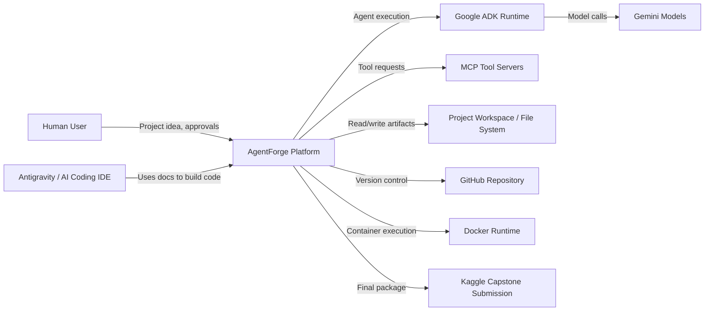

## 5.3 System Boundary

AgentForge owns:

- project intake,
- planning,
- workflow orchestration,
- agent registry,
- plugin loading,
- context assembly,
- memory access,
- MCP adapter layer,
- artifact storage,
- security policy enforcement,
- evaluation execution,
- documentation generation,
- export packaging.

AgentForge does not own:

- the underlying LLM model implementation,
- third-party MCP server internals,
- GitHub infrastructure,
- cloud provider infrastructure,
- Kaggle platform behavior.

---

# 6. High-Level Architecture

## 6.1 Architectural Overview

AgentForge is organized into seven major subsystems:

1. **Interface Layer** — CLI, REST API, future dashboard.
2. **Application Layer** — use cases and workflow services.
3. **Domain Layer** — core entities, value objects, and policies.
4. **Agent Runtime Layer** — ADK agents, plugin agents, task routing.
5. **Workflow Runtime Layer** — graph workflows, state machine, task scheduling.
6. **Infrastructure Layer** — MCP, file system, Git, databases, LLM adapters, artifact store.
7. **Governance Layer** — security, evaluation, observability, audit.

## 6.2 High-Level Component Diagram

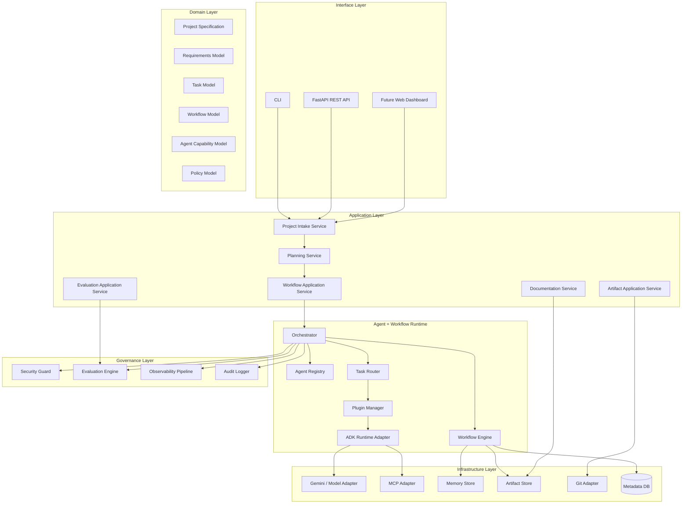

## 6.3 Core Runtime Flow

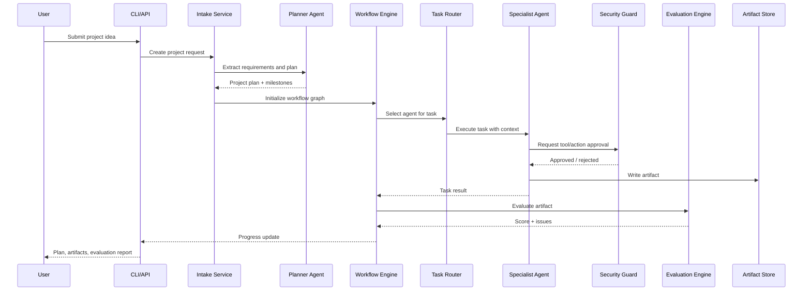

---

# 7. Clean Architecture Model

## 7.1 Layer Overview

AgentForge follows Clean Architecture to protect business logic from framework and infrastructure changes.

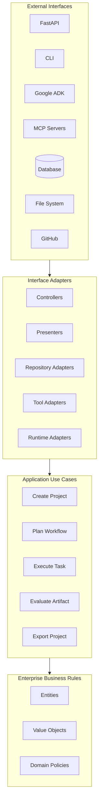

## 7.2 Dependency Rule

Dependencies point inward.

Allowed:

- Interface adapters depend on application use cases.
- Application use cases depend on domain models and ports.
- Infrastructure adapters implement ports.
- Domain layer depends on nothing external.

Forbidden:

- Domain importing ADK.
- Domain importing FastAPI.
- Domain importing SQLAlchemy.
- Domain importing MCP SDKs.
- Application layer directly calling file system APIs.
- Agents directly bypassing security policy to call tools.

## 7.3 Layer Responsibilities

| Layer | Responsibility | Must Not Do |
|---|---|---|
| Domain | Define core business concepts and rules. | Call external APIs or frameworks. |
| Application | Coordinate use cases and workflows. | Implement low-level infrastructure logic. |
| Interface Adapters | Convert external inputs into application commands. | Contain core business rules. |
| Infrastructure | Implement ports for tools, models, storage, and runtime. | Own product workflow decisions. |
| Governance | Enforce security, evaluation, and observability rules. | Mutate domain state without workflow authorization. |

---

# 8. Hexagonal Architecture Model

## 8.1 Rationale

AgentForge must integrate with many external systems: Google ADK, Gemini, MCP tools, databases, file systems, Git, Docker, and cloud platforms. These integrations must not leak into domain logic.

Hexagonal Architecture solves this through:

- inbound ports,
- outbound ports,
- adapters,
- dependency inversion.

## 8.2 Ports and Adapters Diagram

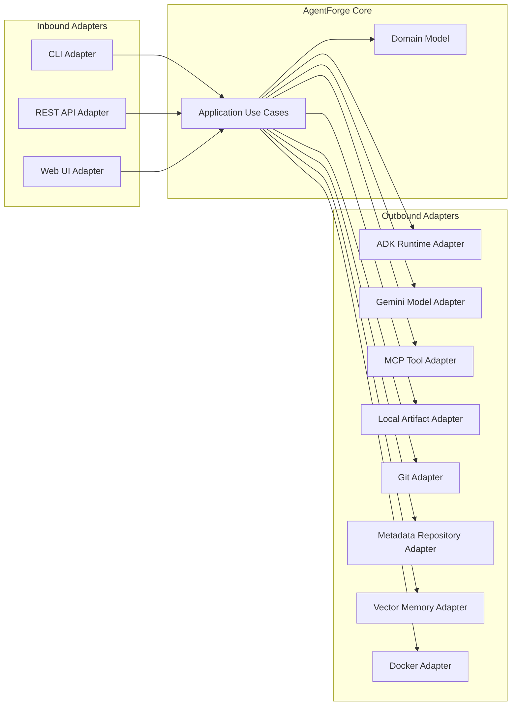

## 8.3 Inbound Ports

| Port | Purpose |
|---|---|
| `ProjectIntakePort` | Accept project ideas and constraints. |
| `WorkflowCommandPort` | Start, pause, resume, cancel, or inspect workflows. |
| `ApprovalPort` | Collect human approvals. |
| `ArtifactQueryPort` | Retrieve generated artifacts and reports. |
| `EvaluationQueryPort` | Retrieve evaluation scores and issue reports. |

## 8.4 Outbound Ports

| Port | Purpose |
|---|---|
| `AgentRuntimePort` | Execute agents through ADK or other runtimes. |
| `ModelPort` | Call Gemini or compatible models. |
| `ToolExecutionPort` | Execute MCP and non-MCP tools. |
| `MemoryPort` | Store and retrieve project context. |
| `ArtifactStorePort` | Save and load generated files. |
| `RepositoryPort` | Persist workflow metadata. |
| `VersionControlPort` | Create commits, branches, diffs, and export packages. |
| `SecurityPolicyPort` | Validate risky operations. |
| `TelemetryPort` | Emit logs, metrics, and traces. |

---

# 9. Domain Architecture

## 9.1 Domain Model Overview

The domain layer defines the language of AgentForge.

Primary domain concepts:

- Project
- Project Specification
- Requirement
- Constraint
- Milestone
- Task
- Agent Capability
- Workflow
- Workflow Run
- Agent Result
- Artifact
- Tool Request
- Evaluation Result
- Security Decision
- Human Approval
- Audit Event

## 9.2 Domain Entity Diagram

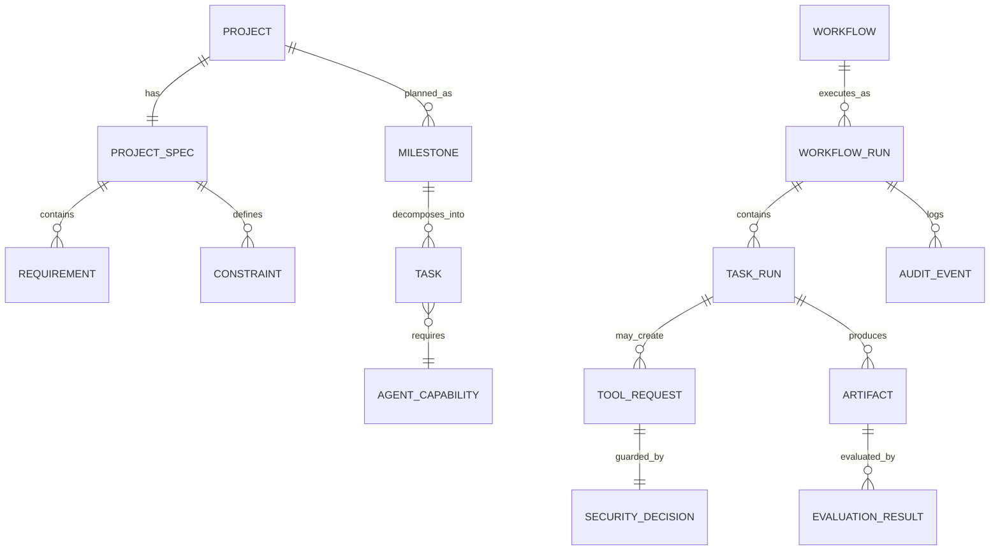

## 9.3 Core Entities

### 9.3.1 Project

Represents a user-requested software project.

Key fields:

- `project_id`
- `name`
- `description`
- `status`
- `created_at`
- `updated_at`
- `owner_id`

### 9.3.2 ProjectSpec

Represents the structured interpretation of the user’s natural language request.

Key fields:

- `project_name`
- `problem_statement`
- `target_users`
- `functional_requirements`
- `nonfunctional_requirements`
- `technology_preferences`
- `constraints`
- `deployment_target`
- `acceptance_criteria`

### 9.3.3 AgentTask

Represents one executable task assigned to an agent.

Key fields:

- `task_id`
- `title`
- `description`
- `required_capabilities`
- `inputs`
- `expected_outputs`
- `dependencies`
- `priority`
- `status`
- `approval_required`

### 9.3.4 AgentCapability

Represents what an agent can do.

Examples:

- `requirements_analysis`
- `system_architecture`
- `backend_generation`
- `frontend_generation`
- `database_design`
- `security_review`
- `test_generation`
- `documentation_generation`
- `deployment_configuration`

### 9.3.5 WorkflowRun

Represents one execution instance of a workflow.

Key fields:

- `workflow_run_id`
- `workflow_id`
- `project_id`
- `status`
- `current_node`
- `state_snapshot`
- `started_at`
- `completed_at`
- `failure_reason`

### 9.3.6 Artifact

Represents an output generated by agents.

Artifact types:

- source code,
- markdown documentation,
- diagrams,
- API contracts,
- tests,
- Docker files,
- CI workflows,
- evaluation reports,
- submission assets.

---

# 10. Application Architecture

## 10.1 Application Services

The application layer coordinates use cases. It does not contain framework-specific implementation.

| Service | Responsibility |
|---|---|
| `ProjectIntakeService` | Accepts project descriptions and creates structured project specs. |
| `RequirementValidationService` | Validates completeness, feasibility, and consistency. |
| `PlanningService` | Converts specs into milestones and tasks. |
| `WorkflowApplicationService` | Creates, starts, resumes, and cancels workflow runs. |
| `AgentRoutingService` | Selects the best agent for a task. |
| `ArtifactApplicationService` | Manages generated files and artifact metadata. |
| `EvaluationApplicationService` | Runs quality checks and stores evaluation results. |
| `DocumentationApplicationService` | Generates and validates documentation packages. |
| `ExportApplicationService` | Packages final projects for GitHub/Kaggle/demo submission. |

## 10.2 Use Case Diagram

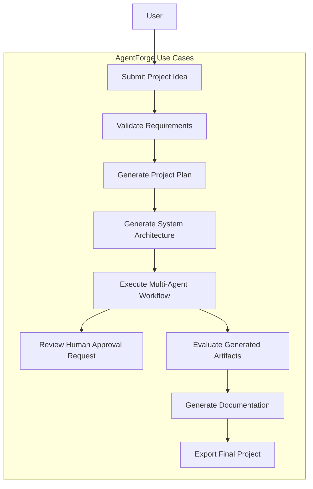

## 10.3 Command/Query Separation

AgentForge should separate write operations from read operations.

Commands:

- `CreateProjectCommand`
- `GeneratePlanCommand`
- `StartWorkflowCommand`
- `PauseWorkflowCommand`
- `ResumeWorkflowCommand`
- `ApproveDecisionCommand`
- `RejectDecisionCommand`
- `ExportProjectCommand`

Queries:

- `GetProjectQuery`
- `GetWorkflowStatusQuery`
- `GetArtifactQuery`
- `GetEvaluationReportQuery`
- `ListAgentsQuery`
- `ListWorkflowEventsQuery`

---

# 11. Interface Architecture

## 11.1 CLI Interface

The CLI is the first-class interface for the capstone.

Example commands:

```bash
agentforge init
agentforge create "Build a FastAPI CRM with React and PostgreSQL"
agentforge plan --project crm
agentforge run --project crm
agentforge status --run latest
agentforge approve --decision security-001
agentforge artifacts --project crm
agentforge export --project crm --target github
```

## 11.2 REST API Interface

The REST API supports programmatic execution and future dashboard integration.

Candidate endpoints:

| Method | Endpoint | Purpose |
|---|---|---|
| `POST` | `/projects` | Create project from natural language input. |
| `GET` | `/projects/{id}` | Retrieve project details. |
| `POST` | `/projects/{id}/plan` | Generate project plan. |
| `POST` | `/workflows/{id}/run` | Start workflow. |
| `GET` | `/workflows/{id}/status` | Retrieve workflow status. |
| `POST` | `/approvals/{id}/approve` | Approve a human checkpoint. |
| `POST` | `/approvals/{id}/reject` | Reject a human checkpoint. |
| `GET` | `/artifacts/{id}` | Retrieve artifact metadata or content. |
| `GET` | `/evaluations/{id}` | Retrieve evaluation report. |

## 11.3 Future Dashboard

The web dashboard is out of scope for the first implementation but should be architecturally supported.

Future dashboard capabilities:

- project creation form,
- workflow graph visualization,
- task progress board,
- agent execution trace,
- artifact browser,
- approval queue,
- evaluation dashboard,
- security event timeline.

---

# 12. Agent Runtime Architecture

## 12.1 Runtime Design

AgentForge uses Google ADK as the agent execution foundation, but wraps ADK behind an internal runtime port. This protects the core architecture from API changes and allows testing with fake runtimes.

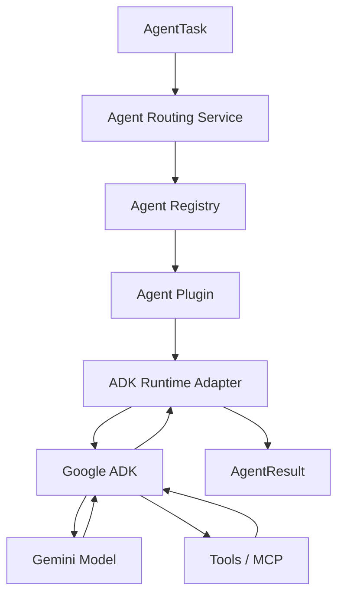

## 12.2 Agent Categories

| Agent | Responsibility |
|---|---|
| Planner Agent | Extracts requirements, creates plan, decomposes tasks. |
| Research Agent | Investigates libraries, patterns, APIs, and tradeoffs. |
| Architect Agent | Designs system architecture, module boundaries, diagrams. |
| Backend Agent | Generates backend services, APIs, domain logic, tests. |
| Frontend Agent | Generates UI structure, components, integration logic. |
| Database Agent | Designs schema, migrations, seed data, data access. |
| DevOps Agent | Generates Docker, CI/CD, deployment configuration. |
| Security Agent | Reviews prompts, tool calls, code, secrets, and risks. |
| Evaluation Agent | Scores artifacts against rubrics and acceptance criteria. |
| Documentation Agent | Produces README, API docs, architecture docs, demo guide. |
| Submission Agent | Produces final capstone package and presentation material. |

## 12.3 Agent Plugin Contract

Every agent must declare:

- identity,
- version,
- capabilities,
- input schema,
- output schema,
- tools required,
- memory access level,
- security permissions,
- evaluation rubric,
- failure behavior.

Example contract:

```yaml
name: backend_agent
version: 1.0.0
capabilities:
  - backend_generation
  - api_design
  - test_generation
inputs:
  - project_spec
  - architecture_plan
  - api_contract
outputs:
  - source_code
  - tests
  - api_docs
tools:
  - filesystem.write
  - python.run_tests
  - git.diff
permissions:
  filesystem:
    write_scope: project_workspace
  network:
    allowed: false
requires_approval: false
```

## 12.4 Agent Execution Rules

An agent must:

1. receive a typed `AgentTask`,
2. receive a bounded `ExecutionContext`,
3. declare intended tool usage,
4. pass security validation,
5. produce structured output,
6. save artifacts through the artifact service,
7. emit telemetry,
8. return a typed `AgentResult`,
9. trigger evaluation where required.

An agent must not:

- directly write outside the project workspace,
- bypass the artifact store,
- call tools without authorization,
- mutate workflow state directly,
- silently ignore errors,
- generate placeholder code as final output.

---

# 13. Workflow Runtime Architecture

## 13.1 Workflow Runtime Purpose

The workflow runtime turns a project plan into an executable graph.

It supports:

- sequential execution,
- parallel execution,
- fan-out/fan-in,
- conditional routing,
- loops,
- retries,
- nested workflows,
- human approval nodes,
- evaluation gates,
- cancellation,
- resume after interruption.

## 13.2 Master Workflow Graph

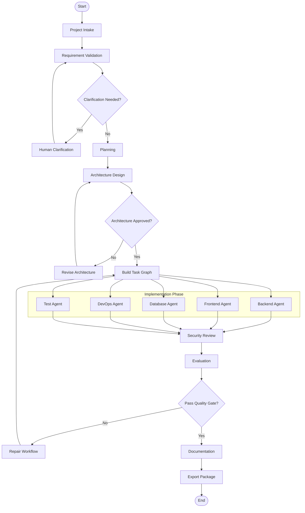

## 13.3 Workflow State Model

| State | Meaning |
|---|---|
| `PENDING` | Workflow has been created but not started. |
| `RUNNING` | Workflow is actively executing. |
| `WAITING_FOR_APPROVAL` | Workflow is paused until human decision. |
| `WAITING_FOR_TOOL` | Workflow is waiting for long-running tool execution. |
| `RETRYING` | A failed node is being retried. |
| `REPAIRING` | Evaluation failed and repair workflow is active. |
| `COMPLETED` | Workflow completed successfully. |
| `FAILED` | Workflow failed and cannot proceed automatically. |
| `CANCELLED` | User or system cancelled execution. |

## 13.4 State Transition Diagram

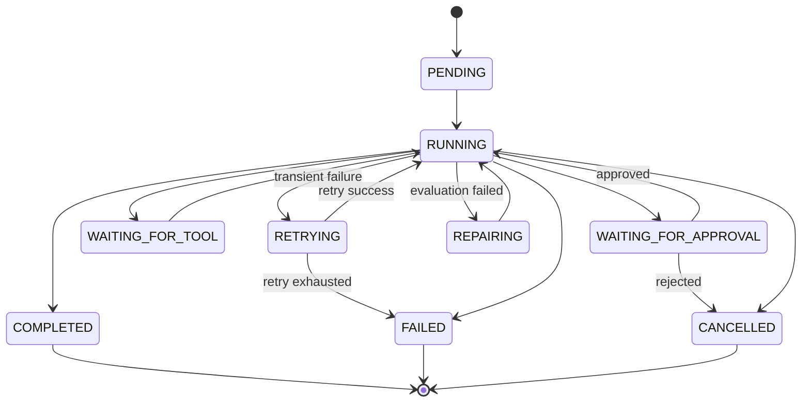

---

# 14. Plugin Architecture

## 14.1 Purpose

The plugin system prevents AgentForge from becoming a rigid hardcoded application. It allows contributors to add new agents, tools, workflows, and evaluators without changing the core runtime.

## 14.2 Plugin Types

| Plugin Type | Example |
|---|---|
| Agent Plugin | Mobile Agent, Backend Agent, Security Agent |
| Tool Plugin | Git Tool, Filesystem Tool, Docker Tool |
| Workflow Plugin | SaaS App Workflow, API-Only Workflow |
| Evaluator Plugin | Security Evaluator, Code Quality Evaluator |
| Memory Plugin | Local Memory, Vector Memory, Cloud Memory |
| Export Plugin | GitHub Exporter, Kaggle Exporter |

## 14.3 Plugin Discovery

Plugin discovery can use:

1. Python entry points,
2. local plugin registry YAML,
3. explicit configuration file,
4. future marketplace registry.

Example registry:

```yaml
plugins:
  agents:
    - name: planner_agent
      module: agentforge_agents.planner:PlannerAgentPlugin
      enabled: true
    - name: backend_agent
      module: agentforge_agents.backend:BackendAgentPlugin
      enabled: true
  tools:
    - name: filesystem_tool
      module: agentforge_tools.filesystem:FilesystemToolPlugin
      enabled: true
```

## 14.4 Plugin Loading Lifecycle

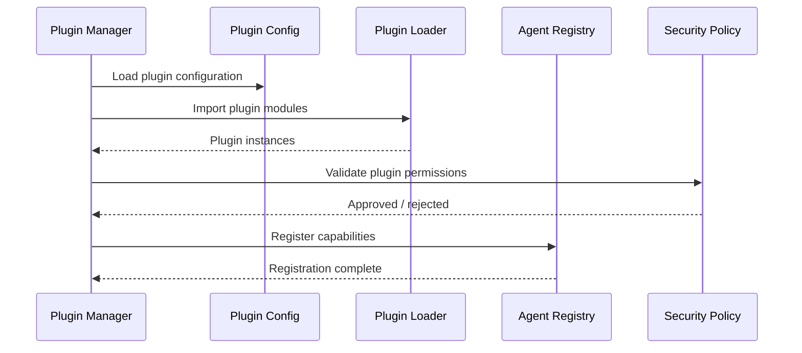

## 14.5 Plugin Safety Rules

A plugin must:

- declare permissions,
- declare version compatibility,
- define input/output schema,
- pass import validation,
- pass security validation,
- include tests,
- include documentation.

A plugin must not:

- execute code during import,
- access secrets directly,
- write outside allowed paths,
- modify workflow state directly,
- disable logging,
- bypass evaluation gates.

---

# 15. Memory Architecture Summary

Detailed memory design is defined in `08_Memory_Architecture.md`. This section defines the system-level boundaries.

## 15.1 Memory Types

| Memory Type | Purpose | Lifetime |
|---|---|---|
| Session State | Current interaction and workflow context. | One workflow run/session. |
| Project Memory | Requirements, decisions, architecture, artifacts. | Project lifetime. |
| Long-Term Memory | Reusable patterns, lessons, user preferences. | Cross-project. |
| Artifact Memory | Generated files and binary artifacts. | Versioned project lifetime. |
| Evaluation Memory | Scores, issues, regressions, improvement history. | Project and release lifetime. |

## 15.2 Memory Flow

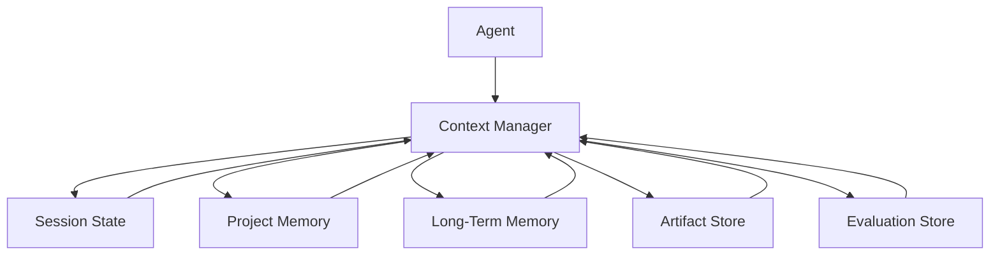

## 15.3 Context Assembly Rules

The Context Manager must assemble context using relevance, recency, task requirements, token budget, and security classification.

Context priority:

1. current task instructions,
2. project specification,
3. architecture decisions,
4. dependency task outputs,
5. relevant artifacts,
6. evaluation issues,
7. prior decisions,
8. long-term reusable patterns.

---

# 16. MCP and Tool Architecture Summary

Detailed MCP design is defined in `09_MCP_Architecture.md`.

## 16.1 Tool Execution Model

Agents must not call tools directly. All tool calls flow through the Tool Execution Gateway.

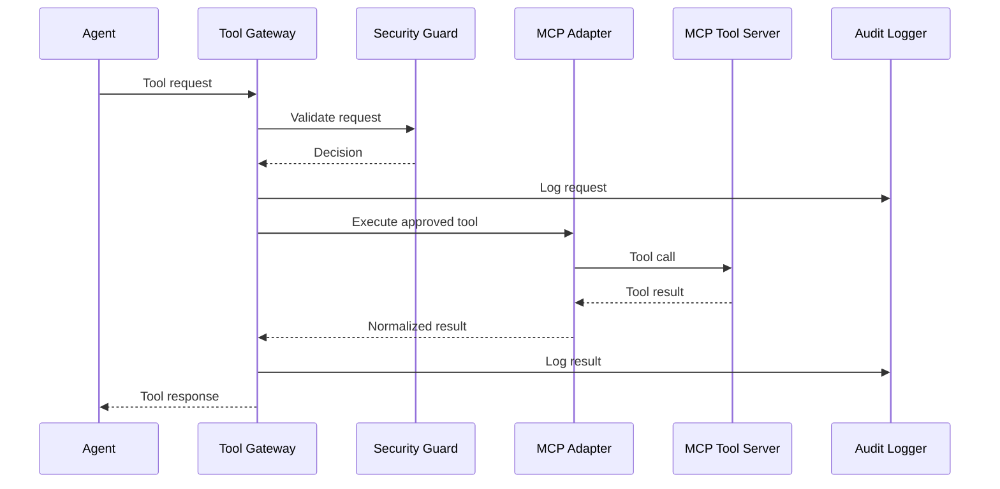

## 16.2 Tool Categories

| Tool Category | Examples |
|---|---|
| File Tools | Read, write, list, diff files. |
| Code Tools | Run tests, lint, type-check, execute scripts. |
| Git Tools | Status, diff, commit, branch. |
| Search Tools | Documentation search, package lookup. |
| Database Tools | Migration generation, schema introspection. |
| Deployment Tools | Docker build, container run, health check. |
| Documentation Tools | Markdown validation, diagram rendering. |

## 16.3 Tool Permission Levels

| Level | Meaning |
|---|---|
| `READ_ONLY` | Can inspect files or metadata. |
| `WORKSPACE_WRITE` | Can write inside project workspace. |
| `EXECUTE_SAFE` | Can run safe commands such as tests or linters. |
| `EXECUTE_RESTRICTED` | Requires approval before running external commands. |
| `NETWORK_ACCESS` | Requires explicit permission. |
| `DESTRUCTIVE` | Always requires human approval. |

---

# 17. Security Architecture Summary

Detailed security design is defined in `10_Security_Architecture.md`.

## 17.1 Security Goals

AgentForge must protect:

- user input,
- system prompts,
- API keys,
- project files,
- generated code,
- tool execution environment,
- workflow state,
- final export package.

## 17.2 Security Control Points

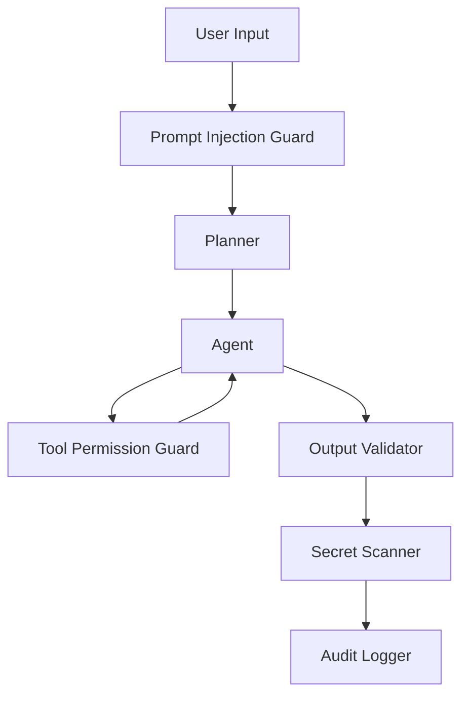

## 17.3 Minimum Security Controls

| Control | Required |
|---|---|
| Prompt injection detection | Yes |
| Tool permission validation | Yes |
| Workspace path sandboxing | Yes |
| Secret scanning | Yes |
| Human approval for destructive operations | Yes |
| Audit logs | Yes |
| Dependency vulnerability scan | Recommended for v1, required for v2 |

---

# 18. Evaluation Architecture Summary

Detailed evaluation design is defined in `11_Evaluation_Architecture.md`.

## 18.1 Evaluation Gates

| Gate | Evaluates |
|---|---|
| Requirements Gate | Completeness, clarity, feasibility. |
| Architecture Gate | Modularity, scalability, traceability. |
| Code Gate | Correctness, tests, maintainability. |
| Security Gate | Vulnerabilities, secrets, unsafe tools. |
| Documentation Gate | Accuracy, completeness, usability. |
| Submission Gate | Capstone readiness and demo reproducibility. |

## 18.2 Evaluation Flow

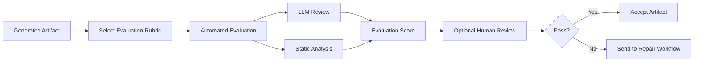

---

# 19. Data Architecture

## 19.1 Data Categories

| Data Category | Examples | Storage |
|---|---|---|
| Project Metadata | project id, name, status | Metadata DB |
| Requirements | FRs, NFRs, constraints | Metadata DB + artifacts |
| Workflow State | run status, node status | Metadata DB |
| Agent Events | messages, tool calls | Event Store |
| Artifacts | generated files | Artifact Store |
| Evaluation Results | scores, issues | Metadata DB + reports |
| Audit Logs | security events | Log store |
| Long-Term Memory | reusable patterns | Vector store / memory service |

## 19.2 Data Flow

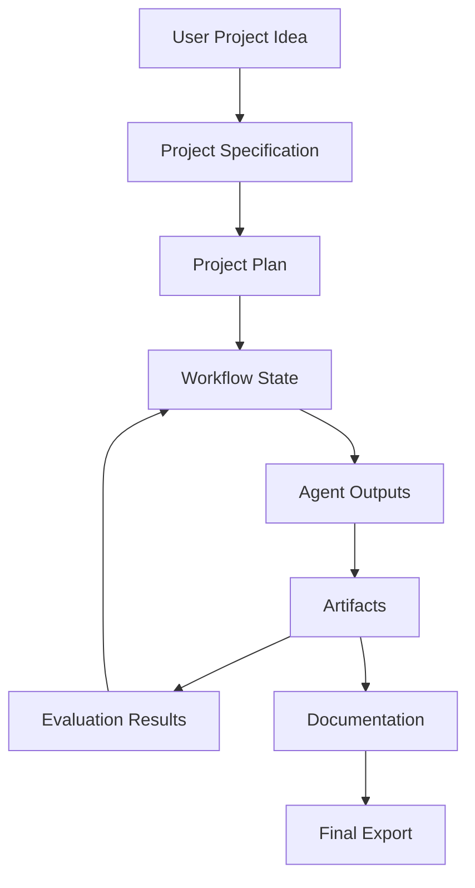

## 19.3 Persistence Strategy

For v1:

- SQLite for local metadata,
- local file system for artifacts,
- JSONL event logs for auditability,
- optional vector store for semantic project memory.

For v2:

- PostgreSQL for metadata,
- object storage for artifacts,
- OpenTelemetry-compatible event pipelines,
- managed vector memory or Vertex AI Agent Engine memory.

---

# 20. Deployment Architecture

## 20.1 Local Development Deployment

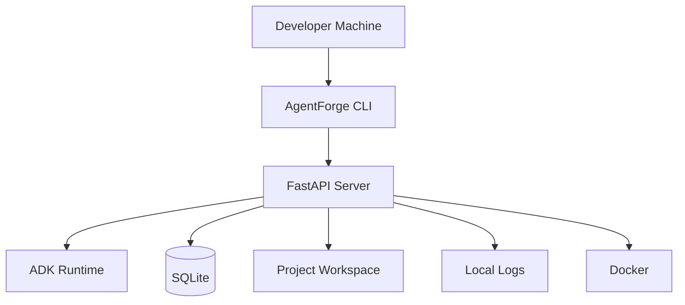

## 20.2 Docker Deployment

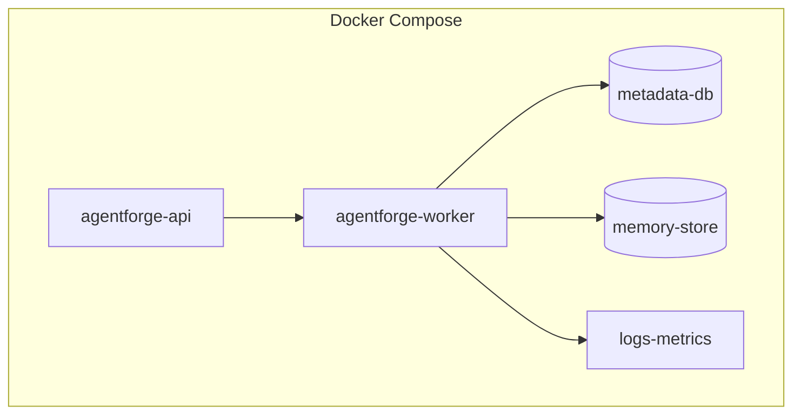

## 20.3 Future Cloud Deployment

Cloud deployment should support:

- Cloud Run for API and worker services,
- GKE for larger workflow workloads,
- managed database,
- managed artifact storage,
- Cloud Trace / OpenTelemetry,
- secret manager,
- CI/CD through GitHub Actions.

Cloud deployment is not required for v1 capstone but architecture must not block it.

---

# 21. Observability Architecture

## 21.1 Observability Signals

| Signal | Examples |
|---|---|
| Logs | task started, task failed, tool called, approval requested. |
| Metrics | workflow duration, tool latency, token usage, retry count. |
| Traces | full request path from project idea to generated artifact. |
| Events | domain events and workflow state transitions. |
| Reports | evaluation and security reports. |

## 21.2 Event Model

Every important runtime activity emits an event.

Examples:

- `ProjectCreated`
- `RequirementsExtracted`
- `WorkflowInitialized`
- `TaskAssigned`
- `AgentStarted`
- `ToolRequested`
- `ToolApproved`
- `ToolRejected`
- `ArtifactCreated`
- `EvaluationCompleted`
- `HumanApprovalRequested`
- `WorkflowCompleted`
- `WorkflowFailed`

## 21.3 Structured Log Schema

```json
{
  "timestamp": "2026-06-28T10:00:00Z",
  "level": "INFO",
  "workflow_run_id": "wf_123",
  "task_id": "task_456",
  "agent_id": "backend_agent",
  "event": "task_completed",
  "duration_ms": 15320,
  "status": "success",
  "metadata": {
    "artifact_count": 4,
    "token_usage": 8120
  }
}
```

---

# 22. Error Handling Architecture

## 22.1 Error Categories

| Error Type | Example | Handling |
|---|---|---|
| Validation Error | Missing project requirement | Ask user clarification. |
| Agent Error | Agent output schema invalid | Retry or repair. |
| Tool Error | MCP server unavailable | Retry with backoff. |
| Security Error | Path traversal attempt | Reject and audit. |
| Evaluation Error | Code quality score below threshold | Trigger repair workflow. |
| Infrastructure Error | Database unavailable | Fail gracefully and preserve state. |
| User Decision Error | Approval rejected | Stop or revise workflow. |

## 22.2 Retry Policy

| Failure Type | Retry? | Strategy |
|---|---|---|
| Transient model failure | Yes | Exponential backoff. |
| Tool timeout | Yes | Bounded retry. |
| Invalid output schema | Yes | One repair prompt, then fail. |
| Security violation | No | Reject immediately. |
| Human rejection | No automatic retry | Require revised plan. |
| Test failure | Yes | Repair workflow. |

## 22.3 Failure Recovery

AgentForge must persist workflow state before and after each task node. This allows workflows to resume after interruption.

Minimum persisted checkpoint:

- workflow run id,
- current node,
- completed nodes,
- pending nodes,
- failed nodes,
- artifact references,
- evaluation results,
- security decisions,
- approval decisions.

---

# 23. Repository Architecture

## 23.1 Proposed Repository Structure

```text
agentforge/
├── README.md
├── pyproject.toml
├── uv.lock
├── .env.example
├── .gitignore
├── docker-compose.yml
├── Dockerfile
├── Makefile
│
├── docs/
│   ├── foundation/
│   ├── architecture/
│   ├── implementation/
│   ├── prompts/
│   └── submission/
│
├── src/
│   └── agentforge/
│       ├── __init__.py
│       │
│       ├── domain/
│       │   ├── entities/
│       │   ├── value_objects/
│       │   ├── policies/
│       │   └── events/
│       │
│       ├── application/
│       │   ├── commands/
│       │   ├── queries/
│       │   ├── services/
│       │   ├── workflows/
│       │   └── ports/
│       │
│       ├── runtime/
│       │   ├── orchestrator/
│       │   ├── routing/
│       │   ├── registry/
│       │   ├── plugins/
│       │   └── adk/
│       │
│       ├── agents/
│       │   ├── planner/
│       │   ├── research/
│       │   ├── architect/
│       │   ├── backend/
│       │   ├── frontend/
│       │   ├── database/
│       │   ├── devops/
│       │   ├── security/
│       │   ├── evaluation/
│       │   └── documentation/
│       │
│       ├── infrastructure/
│       │   ├── persistence/
│       │   ├── memory/
│       │   ├── artifacts/
│       │   ├── tools/
│       │   ├── mcp/
│       │   ├── git/
│       │   ├── docker/
│       │   └── models/
│       │
│       ├── governance/
│       │   ├── security/
│       │   ├── evaluation/
│       │   ├── observability/
│       │   └── audit/
│       │
│       ├── interfaces/
│       │   ├── cli/
│       │   ├── api/
│       │   └── schemas/
│       │
│       └── config/
│
├── tests/
│   ├── unit/
│   ├── integration/
│   ├── workflow/
│   ├── security/
│   ├── evaluation/
│   └── e2e/
│
├── examples/
│   ├── simple_fastapi_project/
│   └── capstone_demo_project/
│
├── scripts/
│   ├── run_local.sh
│   ├── validate_docs.py
│   └── package_submission.py
│
└── submissions/
    ├── demo_script.md
    ├── kaggle_writeup.md
    └── presentation_outline.md
```

## 23.2 Repository Rules

- `domain/` must not import external frameworks.
- `application/` may import domain and ports only.
- `infrastructure/` implements ports.
- `interfaces/` calls application services.
- `agents/` implement agent plugins and must use runtime services.
- `governance/` exposes reusable policy/evaluation services.
- Tests must mirror package structure.

---

# 24. Technology Architecture

## 24.1 Recommended Technology Stack

| Area | Technology | Reason |
|---|---|---|
| Agent Framework | Google ADK | Capstone alignment and native agent/workflow support. |
| LLM | Gemini | Google ecosystem alignment. |
| Language | Python | ADK maturity, tooling, ecosystem. |
| API | FastAPI | Typed, async, easy docs. |
| CLI | Typer | Pythonic CLI with type hints. |
| Config | Pydantic Settings | Typed configuration. |
| Persistence v1 | SQLite | Simple local metadata store. |
| Persistence v2 | PostgreSQL | Production-grade metadata store. |
| Artifacts | Local filesystem | Capstone-friendly and inspectable. |
| Memory v1 | SQLite + local vector store optional | Local-first development. |
| Testing | Pytest | Standard Python testing. |
| Linting | Ruff | Fast linting. |
| Formatting | Black or Ruff format | Consistent code style. |
| Typing | MyPy / Pyright | Type safety. |
| Containers | Docker | Reproducible runtime. |
| CI | GitHub Actions | Open-source workflow. |
| Observability | Structured logs + OpenTelemetry-ready design | Local now, cloud later. |

---

# 25. Architecture Decisions

## ADR-001 — Use Google ADK as Primary Agent Runtime

**Decision:** AgentForge will use Google ADK as the primary runtime for agent execution and workflow orchestration.

**Rationale:** The project targets the Kaggle x Google AI Agents course and should demonstrate ADK concepts directly.

**Consequences:**

- Architecture aligns with ADK agents, workflows, tools, sessions, memory, artifacts, callbacks, evaluation, and deployment.
- A runtime adapter is required to prevent vendor lock-in.

## ADR-002 — Use Clean Architecture

**Decision:** AgentForge will separate domain, application, infrastructure, interface, runtime, and governance layers.

**Rationale:** Multi-agent projects easily become coupled and difficult to test. Clean Architecture protects the core model.

**Consequences:**

- More initial structure.
- Easier testing and extension.
- Better long-term maintainability.

## ADR-003 — Use Plugin-Based Agent Architecture

**Decision:** Specialist agents are plugins that declare capabilities and permissions.

**Rationale:** The platform must support new agent types such as Mobile Agent, Data Science Agent, Game Agent, or Cloud Agent without orchestrator rewrites.

**Consequences:**

- Requires plugin registry and capability routing.
- Enables extensibility and portfolio strength.

## ADR-004 — Use Tool Gateway for All Tool Calls

**Decision:** Agents cannot directly call external tools. All tool calls pass through a Tool Gateway.

**Rationale:** Tool execution is the most security-sensitive part of an agentic system.

**Consequences:**

- Better auditability.
- Centralized security policy.
- Slightly more implementation work.

## ADR-005 — Evaluation as a Runtime Gate

**Decision:** Evaluation is part of the workflow runtime, not a final optional step.

**Rationale:** Generated artifacts must be validated continuously.

**Consequences:**

- Failed artifacts trigger repair workflows.
- Evaluation reports become first-class artifacts.

---

# 26. Requirements Traceability Matrix

| Requirement | Architecture Component | Notes |
|---|---|---|
| FR-001 Accept Natural Language Projects | Project Intake Service | Converts user prompt to structured project request. |
| FR-002 Requirement Clarification | Planner Agent + Approval Port | Pauses workflow for missing critical information. |
| FR-003 Requirement Validation | Requirement Validation Service | Validates feasibility and consistency. |
| FR-004 Project Planning | Planning Service + Planner Agent | Produces milestones and task graph. |
| FR-005 Task Decomposition | Planner Agent | Creates atomic tasks. |
| FR-006 Task Prioritization | Task Router | Assigns priority based on dependency and risk. |
| FR-007 Workflow Initialization | Workflow Engine | Creates graph from project plan. |
| FR-008 Workflow State Management | Workflow Engine + Metadata DB | Maintains persistent state. |
| FR-009 Agent Task Routing | Agent Routing Service + Registry | Selects agent by capability. |
| NFR-001 Response Time | CLI/API + Runtime | Requires streaming/progress updates. |
| NFR-003 Agent Scalability | Plugin Manager + Agent Registry | Supports many agent plugins. |
| NFR-005 Fault Tolerance | Workflow Engine | Retry and recovery policies. |
| NFR-008 Code Quality | Repository Structure + CI | Enforced through lint/type/test gates. |
| NFR-010 Plugin Architecture | Plugin Manager | Supports runtime extension. |
| NFR-014 Prompt Injection Protection | Security Guard | Validates prompts and tool calls. |
| NFR-016 Structured Logging | Observability Pipeline | Required for every component. |
| NFR-019 Automated Testing | Test Architecture | Unit, integration, workflow, security, eval tests. |
| NFR-023 External Configuration | Config Layer | No hardcoded models, tools, keys, policies. |

---

# 27. Testing Architecture

## 27.1 Test Categories

| Test Type | Purpose |
|---|---|
| Unit Tests | Validate domain entities, policies, services. |
| Integration Tests | Validate adapters, DB, artifact store, MCP adapters. |
| Workflow Tests | Validate graph execution and state transitions. |
| Agent Tests | Validate agent input/output contracts. |
| Security Tests | Validate prompt injection and tool permissions. |
| Evaluation Tests | Validate scoring rubrics and quality gates. |
| End-to-End Tests | Validate complete project generation workflow. |

## 27.2 Minimum Test Gates

Before a workflow can be considered production-ready:

- all unit tests pass,
- all workflow tests pass,
- security tests pass,
- evaluation score meets threshold,
- generated demo project can run locally,
- generated README instructions are reproducible.

---

# 28. Performance and Scalability Architecture

## 28.1 Performance Targets

| Target | Expected Value |
|---|---|
| CLI command startup | Under 3 seconds. |
| Workflow status response | Under 2 seconds. |
| Plugin discovery for 100 agents | Under 5 seconds. |
| Task routing decision | Under 1 second after registry load. |
| Artifact metadata query | Under 1 second locally. |

## 28.2 Scalability Strategy

v1 scalability:

- local workflow execution,
- parallel independent tasks where safe,
- bounded concurrency,
- local artifact storage.

v2 scalability:

- distributed workers,
- queue-based task dispatch,
- cloud artifact storage,
- managed metadata database,
- horizontally scaled runtime services.

---

# 29. Implementation Strategy

## 29.1 Build Order

Implementation should follow this order:

1. Domain models.
2. Application ports.
3. Configuration system.
4. Artifact store.
5. Metadata persistence.
6. Plugin registry.
7. Agent capability contracts.
8. ADK runtime adapter.
9. Workflow engine wrapper.
10. Planner Agent.
11. Specialist agents.
12. Tool gateway.
13. Security guard.
14. Evaluation engine.
15. Documentation generator.
16. CLI.
17. REST API.
18. Docker and CI.
19. Demo workflow.
20. Submission package.

## 29.2 Implementation Guardrails

The AI coding assistant must:

- read this document before implementation,
- preserve architecture boundaries,
- implement tests with each module,
- never generate placeholder final code,
- never bypass security checks,
- never import infrastructure into domain,
- keep adapters replaceable,
- keep agents plugin-based,
- ensure every workflow emits events,
- ensure every artifact is evaluated.

---

# 30. Capstone Demonstration Architecture

## 30.1 Recommended Demo Scenario

The best demo project for AgentForge should be simple enough to finish but rich enough to demonstrate full lifecycle architecture.

Recommended demo:

> Generate a Task Management API with FastAPI, SQLite/PostgreSQL, JWT-style authentication scaffold, Docker, tests, README, and OpenAPI documentation.

Why this works:

- backend generation is clear,
- architecture can be evaluated,
- tests are executable,
- Docker demo is simple,
- documentation is meaningful,
- security review has real work,
- generated artifacts are easy for judges to inspect.

## 30.2 Demo Workflow

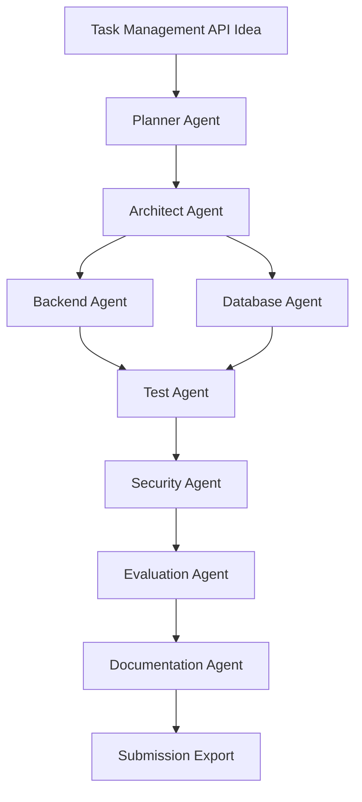

## 30.3 Demo Success Criteria

The demo succeeds if:

- the user submits one natural language request,
- AgentForge generates a plan,
- multiple specialist agents execute,
- artifacts are produced,
- tests are generated and runnable,
- evaluation results are produced,
- a README and demo guide are generated,
- the final output is exportable as a repository.

---

# 31. Future Architecture

Future versions may add:

- visual workflow builder,
- multi-user projects,
- agent marketplace,
- cloud deployment wizard,
- persistent organizational memory,
- enterprise authentication,
- workspace collaboration,
- domain-specific agent packs,
- automated architecture optimization,
- long-running background workflows,
- advanced A2A interoperability.

---

# 32. Architecture Acceptance Criteria

This architecture document is accepted when:

- architecture supports Google ADK-based multi-agent workflows,
- architecture supports plugin-based agents,
- architecture separates domain, application, infrastructure, runtime, and interface layers,
- architecture defines memory, MCP, security, evaluation, and observability boundaries,
- architecture maps to functional and non-functional requirements,
- architecture provides diagrams and implementation guidance,
- architecture is sufficient for an AI coding assistant to scaffold the project without guessing major boundaries.

---

# 33. Reference Basis

This document is aligned with the following external technical references as of June 2026:

1. Google Agent Development Kit documentation, including agents, tools, workflows, sessions, memory, artifacts, callbacks, evaluation, deployment, and observability.
2. Google ADK Python repository notes for ADK 2.x, including graph workflow runtime and task API concepts.
3. Google and Kaggle AI Agents Intensive course announcement and capstone framing.
4. General Clean Architecture, Hexagonal Architecture, SOLID, and production Python engineering practices.

---

# 34. Revision History

| Version | Date | Status | Notes |
|---|---|---|---|
| 1.0.0 | June 2026 | Draft | Initial complete system architecture specification for AgentForge. |

---

# 35. Next Documents

The following architecture documents should be created after this file:

1. `06_Agent_Architecture.md`
2. `07_Workflow_Architecture.md`
3. `08_Memory_Architecture.md`
4. `09_MCP_Architecture.md`
5. `10_Security_Architecture.md`
6. `11_Evaluation_Architecture.md`

Each of these documents must refine the boundaries established in this master system architecture.
