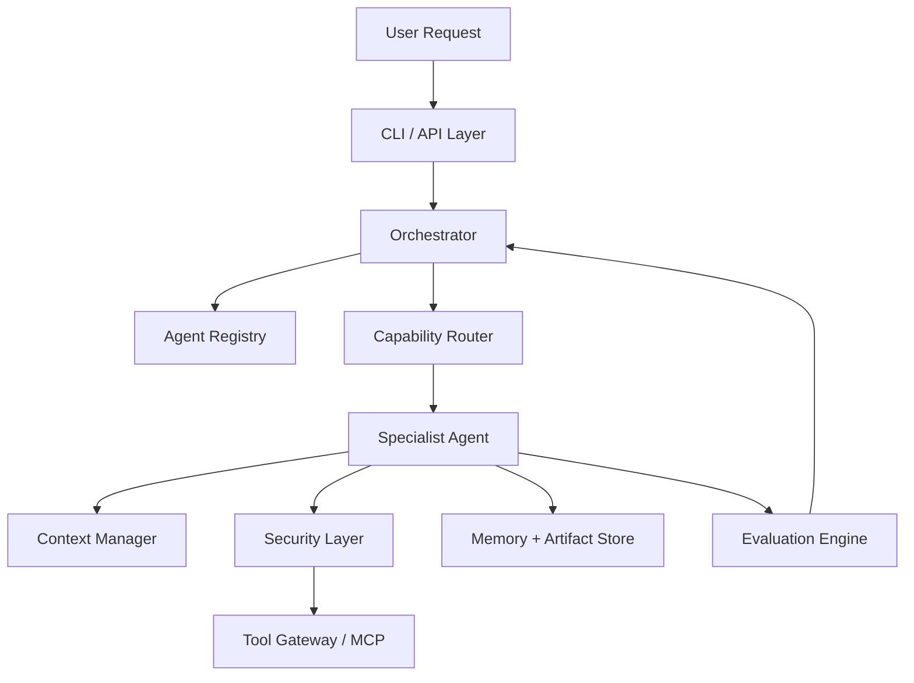
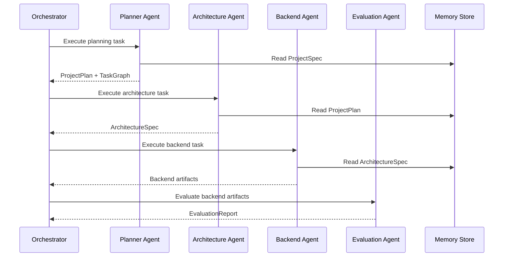

# 06_Agent_Architecture.md

**Project:** AgentForge  
**Document Version:** 1.0.0  
**Status:** Draft for Implementation  
**Owner:** AgentForge Core Team  
**Last Updated:** June 2026  
**Document Type:** Agent Architecture Specification  
**Depends On:** `05_System_Architecture.md`  
**Target Runtime:** Google Agent Development Kit (ADK) 2.x  

> This document defines the agent model, plugin contracts, specialist agent responsibilities, routing rules, prompt boundaries, tool permissions, and validation expectations for AgentForge.

---

## Related Documents

| Document | Purpose |
|---|---|
| `03_Functional_Requirements.md` | Defines system behaviors that agents must satisfy. |
| `04_NonFunctional_Requirements.md` | Defines quality attributes for reliability, security, maintainability, and observability. |
| `05_System_Architecture.md` | Defines the master system architecture and dependency rules. |
| `07_Workflow_Architecture.md` | Defines workflow graphs and orchestration patterns. |
| `08_Memory_Architecture.md` | Defines memory scopes, artifacts, and context packaging. |
| `09_MCP_Architecture.md` | Defines tool integration and MCP gateway rules. |
| `10_Security_Architecture.md` | Defines security boundaries and guardrails. |
| `11_Evaluation_Architecture.md` | Defines evaluation metrics and gates. |

---

# 1. Purpose

This document defines how agents are designed, registered, executed, evaluated, and extended inside AgentForge.

AgentForge shall not rely on one monolithic general-purpose assistant. It shall use a coordinated team of specialist agents with clear responsibilities, explicit input and output contracts, and controlled tool permissions.

The agent architecture supports the following goals:

- modular agent development,
- capability-based routing,
- plugin-based extensibility,
- predictable delegation,
- secure tool execution,
- shared project context,
- evaluation-driven output acceptance,
- human review for critical decisions.

---

# 2. Agent Architecture Vision

AgentForge models a software engineering team.

Each agent represents one engineering role:

| Engineering Role | AgentForge Agent |
|---|---|
| Product analyst | Requirements Agent |
| Technical lead | Planner Agent |
| Solution architect | Architecture Agent |
| Backend engineer | Backend Agent |
| Frontend engineer | Frontend Agent |
| Database engineer | Database Agent |
| DevOps engineer | DevOps Agent |
| Security engineer | Security Agent |
| QA engineer | Evaluation Agent |
| Technical writer | Documentation Agent |
| Release coordinator | Submission Agent |

The Orchestrator acts like an engineering manager. It does not perform specialist work directly. It delegates work to agents using a capability registry.

---

# 3. ADK Alignment

AgentForge aligns with Google ADK by treating each specialist as an autonomous execution unit with:

- model configuration,
- task instructions,
- tool access,
- session state,
- workflow participation,
- optional parent/sub-agent relationships,
- evaluation hooks.

ADK supports moving from simple agents to workflows when an agent application becomes more complex. AgentForge therefore uses workflows as the default execution model rather than treating multi-agent orchestration as an afterthought.

AgentForge also uses the ADK-inspired idea that smaller, specialized agents are more maintainable and reliable than one large prompt attempting to perform all work.

---

# 4. Agent Design Principles

## 4.1 Single Responsibility

Each agent must own one primary responsibility.

Examples:

- The Backend Agent generates backend code.
- The Security Agent evaluates risks and policy violations.
- The Documentation Agent writes docs.

No agent may perform unrelated tasks unless explicitly delegated through a workflow.

## 4.2 Capability Declaration

Every agent must declare its capabilities before it can receive tasks.

Capabilities include:

- domain responsibilities,
- supported artifacts,
- allowed tools,
- input schemas,
- output schemas,
- risk level,
- evaluation requirements.

## 4.3 Tool Least Privilege

Agents receive only the tools required for their task.

Example:

- Documentation Agent may read project artifacts but should not modify deployment scripts without approval.
- Backend Agent may write backend source files but should not delete repository directories.
- Security Agent may inspect all artifacts but should not execute generated code unless through a sandbox.

## 4.4 Structured Outputs

Every agent must return structured outputs.

Free-form text is allowed only as explanation, not as the primary machine-readable result.

## 4.5 Evaluability

Every agent output must be easy to evaluate.

A task is incomplete if its result cannot be checked against acceptance criteria.

## 4.6 Replaceability

Agents must be replaceable.

A future Mobile Agent, Data Science Agent, Game Development Agent, or Cloud Agent must be addable without rewriting the Orchestrator.

---

# 5. Core Agent Runtime Model

## 5.1 Runtime Components



## 5.2 Agent Lifecycle

| State | Meaning |
|---|---|
| `registered` | Agent plugin discovered and validated. |
| `available` | Agent can receive tasks. |
| `assigned` | Agent has been selected for a task. |
| `running` | Agent is executing. |
| `waiting_for_tool` | Agent requested a tool call. |
| `waiting_for_human` | Agent requires approval or clarification. |
| `completed` | Agent returned a valid result. |
| `failed` | Agent failed after retries. |
| `quarantined` | Agent output or behavior violated policy. |

---

# 6. Agent Plugin Contract

## 6.1 Contract Overview

Every AgentForge agent must implement a common contract.

```python
from typing import Protocol

class AgentPlugin(Protocol):
    name: str
    version: str
    description: str
    capabilities: list["Capability"]
    allowed_tools: list[str]
    risk_level: str

    async def validate_task(self, task: "AgentTask") -> "ValidationResult":
        ...

    async def execute(
        self,
        task: "AgentTask",
        context: "ExecutionContext",
    ) -> "AgentResult":
        ...

    async def self_review(
        self,
        result: "AgentResult",
        context: "ExecutionContext",
    ) -> "ReviewResult":
        ...
```

## 6.2 Capability Schema

```python
class Capability(BaseModel):
    id: str
    name: str
    description: str
    input_artifacts: list[str]
    output_artifacts: list[str]
    required_tools: list[str]
    supported_languages: list[str] = []
    supported_frameworks: list[str] = []
    risk_level: Literal["low", "medium", "high"]
```

## 6.3 Agent Task Schema

```python
class AgentTask(BaseModel):
    task_id: str
    workflow_id: str
    title: str
    description: str
    priority: Literal["critical", "high", "medium", "low"]
    acceptance_criteria: list[str]
    required_capabilities: list[str]
    input_artifacts: list[ArtifactRef]
    expected_outputs: list[str]
    constraints: dict[str, Any]
    requires_human_approval: bool = False
```

## 6.4 Agent Result Schema

```python
class AgentResult(BaseModel):
    task_id: str
    agent_name: str
    status: Literal["success", "partial", "failed", "blocked"]
    summary: str
    artifacts: list[ArtifactRef]
    decisions: list[DecisionRecord]
    risks: list[RiskRecord]
    assumptions: list[str]
    evaluation_hints: list[str]
    next_actions: list[str]
```

---

# 7. Agent Registry

## 7.1 Purpose

The Agent Registry stores all available agent plugins and exposes them to the Capability Router.

The registry must answer:

- Which agents are available?
- What can each agent do?
- Which tools may each agent access?
- Which agent version produced a result?
- Which agents are disabled, experimental, or quarantined?

## 7.2 Registry Data Model

```python
class AgentRegistryEntry(BaseModel):
    name: str
    version: str
    description: str
    module_path: str
    class_name: str
    enabled: bool
    experimental: bool
    capabilities: list[Capability]
    allowed_tools: list[str]
    risk_level: str
    owner: str
```

## 7.3 Discovery Rules

Agent plugins may be discovered from:

- built-in package modules,
- `plugins/agents/` directory,
- external Python packages,
- future ADK skill packages.

The Orchestrator must not import random files directly. The Plugin Loader validates every plugin before registration.

---

# 8. Capability Router

## 8.1 Routing Purpose

The Capability Router maps tasks to agents.

Routing is based on:

- required capabilities,
- output artifact type,
- framework/language match,
- tool requirements,
- agent availability,
- previous performance scores,
- risk level,
- workflow constraints.

## 8.2 Routing Decision Record

Every routing decision must be logged.

```python
class RoutingDecision(BaseModel):
    task_id: str
    selected_agent: str
    candidate_agents: list[str]
    selection_reason: str
    confidence_score: float
    rejected_candidates: dict[str, str]
```

## 8.3 Routing Policy

| Scenario | Policy |
|---|---|
| One strong match | Assign directly. |
| Multiple strong matches | Use performance history and workflow preference. |
| No match | Return blocked task and request human intervention. |
| High-risk task | Route through Security Agent first or require approval. |
| Failed task | Retry with same agent once, then alternate agent if available. |

---

# 9. Built-in Agent Team

## 9.1 Planner Agent

**Purpose:** Convert validated project requirements into milestones, tasks, dependencies, and execution order.

**Responsibilities:**

- create project plan,
- break milestones into tasks,
- identify dependencies,
- identify high-risk work,
- define acceptance criteria,
- create workflow graph draft.

**Inputs:**

- `ProjectSpec`,
- user constraints,
- requirements document,
- previous decisions.

**Outputs:**

- `ProjectPlan`,
- `TaskGraph`,
- `RiskRegister`,
- `PlanningDecisionLog`.

**Allowed Tools:**

- memory read,
- documentation search,
- task graph writer.

**Not Allowed:**

- writing source code directly,
- modifying deployment files,
- executing shell commands.

## 9.2 Requirements Agent

**Purpose:** Transform natural-language user input into structured requirements.

**Responsibilities:**

- extract functional requirements,
- extract non-functional requirements,
- identify missing requirements,
- detect contradictions,
- produce clarification questions,
- generate acceptance criteria.

**Outputs:**

- `RequirementsSpec`,
- `ClarificationQuestions`,
- `RequirementValidationReport`.

## 9.3 Research Agent

**Purpose:** Investigate technical options and provide grounded recommendations.

**Responsibilities:**

- compare frameworks,
- inspect official documentation,
- identify package compatibility,
- document trade-offs,
- produce research notes.

**Rule:** Research Agent must prefer primary sources such as official documentation.

## 9.4 Architecture Agent

**Purpose:** Produce software architecture artifacts.

**Responsibilities:**

- propose system architecture,
- define module boundaries,
- define API contracts,
- define data model,
- create diagrams,
- produce ADRs.

**Outputs:**

- `ArchitectureSpec`,
- `ComponentDiagram`,
- `SequenceDiagram`,
- `ADRSet`.

## 9.5 Backend Agent

**Purpose:** Generate backend application code.

**Responsibilities:**

- create API routes,
- implement services,
- implement domain models,
- implement validation,
- write tests,
- generate OpenAPI metadata.

**Default Stack:** FastAPI, Pydantic, SQLAlchemy or SQLModel, pytest.

## 9.6 Frontend Agent

**Purpose:** Generate frontend application code.

**Responsibilities:**

- create UI structure,
- implement components,
- integrate API client,
- handle form validation,
- implement state management,
- write component tests where applicable.

**Default Stack:** React + TypeScript + Vite.

## 9.7 Database Agent

**Purpose:** Design and implement persistence layer.

**Responsibilities:**

- create ERD,
- design schema,
- generate migrations,
- define indexes,
- create seed data,
- validate normalization.

## 9.8 DevOps Agent

**Purpose:** Produce local deployment and CI/CD assets.

**Responsibilities:**

- Dockerfile,
- docker-compose,
- GitHub Actions,
- environment templates,
- health checks,
- deployment guide.

## 9.9 Security Agent

**Purpose:** Protect the workflow and generated project.

**Responsibilities:**

- prompt-injection detection,
- secrets scanning,
- dependency risk review,
- generated-code risk review,
- tool permission enforcement,
- audit log review.

Security Agent may block a workflow if critical issues are found.

## 9.10 Evaluation Agent

**Purpose:** Measure the quality of artifacts and agent outputs.

**Responsibilities:**

- run rubric-based evaluation,
- run test suites,
- compare outputs to acceptance criteria,
- detect regressions,
- produce quality scores.

## 9.11 Documentation Agent

**Purpose:** Generate user-facing and developer-facing documentation.

**Responsibilities:**

- README,
- setup guide,
- API docs,
- architecture summary,
- demo script,
- changelog,
- submission write-up.

## 9.12 Submission Agent

**Purpose:** Assemble capstone-ready deliverables.

**Responsibilities:**

- verify README completeness,
- prepare demo guide,
- produce final project summary,
- check repository hygiene,
- generate submission checklist.

---

# 10. Agent Prompt Contracts

Each agent prompt must include:

1. role,
2. responsibility boundary,
3. input schema,
4. output schema,
5. forbidden actions,
6. tool policy,
7. quality criteria,
8. error behavior.

Example prompt skeleton:

```text
You are the Backend Agent for AgentForge.
Your responsibility is limited to backend implementation.
You must read the provided ProjectSpec, ArchitectureSpec, and TaskSpec.
You must produce typed, tested, maintainable backend code.
You must not modify frontend, infrastructure, or security policy files unless explicitly instructed.
Return your result using the AgentResult schema.
```

---

# 11. Agent Communication Model

Agents do not communicate through informal hidden chat.

They communicate through:

- task objects,
- artifact references,
- shared context packs,
- workflow state,
- decision records,
- evaluation reports.



---

# 12. Human-in-the-Loop Agent Boundaries

Human approval is required for:

- destructive file operations,
- deployment actions,
- security exceptions,
- architecture changes after implementation begins,
- dependency additions with high risk,
- final submission packaging.

The agent must produce an approval request with:

- action requested,
- reason,
- impact,
- alternatives,
- recommended decision.

---

# 13. Failure Handling

| Failure Type | Behavior |
|---|---|
| Invalid input | Return clarification request. |
| Tool denied | Return blocked result with reason. |
| Tool failure | Retry according to tool policy. |
| Output schema invalid | Ask same agent to repair once. |
| Evaluation failure | Route to Refiner Agent or original agent. |
| Security violation | Quarantine output and notify workflow. |

---

# 14. Testing Strategy

Agent architecture must be tested through:

- plugin loading tests,
- capability routing tests,
- prompt contract tests,
- output schema tests,
- tool permission tests,
- agent failure simulation,
- workflow integration tests.

Minimum test files:

```text
tests/agents/test_agent_registry.py
tests/agents/test_capability_router.py
tests/agents/test_agent_contracts.py
tests/agents/test_agent_permissions.py
tests/agents/test_agent_result_schema.py
```

---

# 15. Requirements Traceability

| Requirement | Agent Architecture Mapping |
|---|---|
| FR-004 Project Planning | Planner Agent |
| FR-005 Task Decomposition | Planner Agent |
| FR-009 Agent Task Routing | Capability Router |
| FR-010 Plugin Architecture | Agent Plugin Contract |
| FR-014 Security Controls | Security Agent |
| FR-019 Automated Testing | Evaluation Agent |
| NFR-003 Agent Scalability | Agent Registry + Plugin Loader |
| NFR-010 Plugin Architecture | Agent Plugin Contract |
| NFR-014 Prompt Injection Protection | Security Agent |

---

# 16. Implementation Checklist

- [ ] Create `AgentPlugin` protocol.
- [ ] Create `Capability` model.
- [ ] Create `AgentTask` model.
- [ ] Create `AgentResult` model.
- [ ] Create registry loader.
- [ ] Create capability router.
- [ ] Implement built-in agents.
- [ ] Add prompt templates.
- [ ] Add security permission map.
- [ ] Add evaluation hooks.
- [ ] Add tests for all agent contracts.

---

# 17. External Alignment Notes

This architecture is aligned with current Google ADK concepts for agents, workflows, tools, session state, and multi-agent systems. It also keeps room for ADK Skills as an optional future plugin format rather than making experimental functionality mandatory for version 1.
