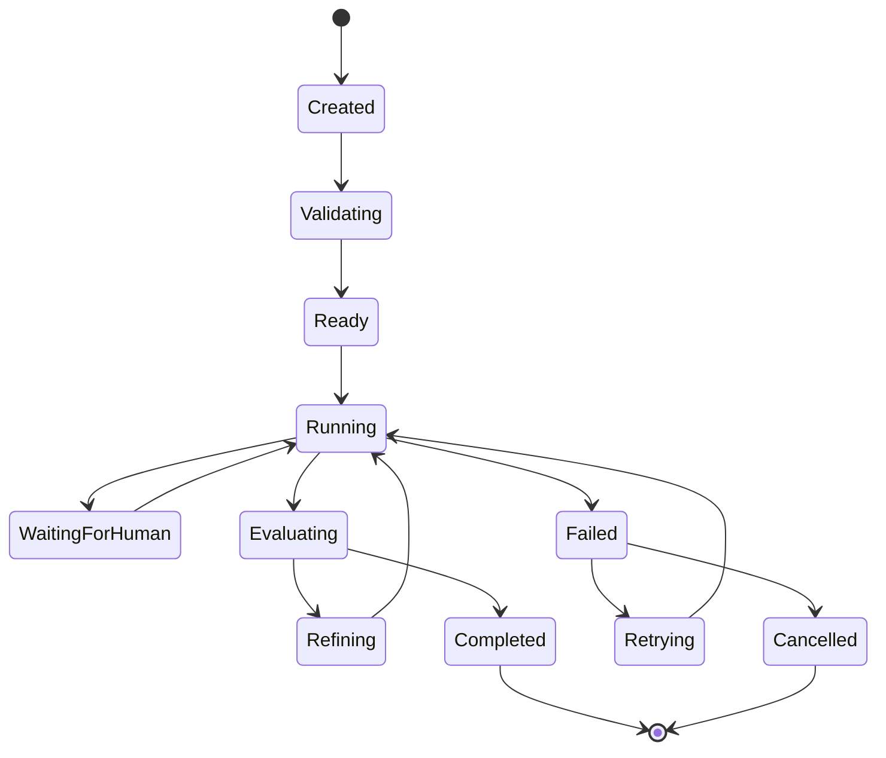
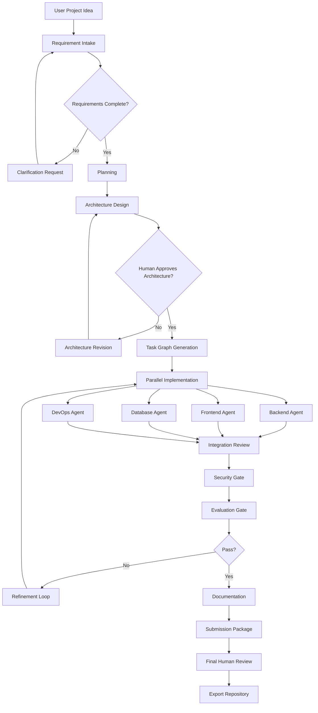
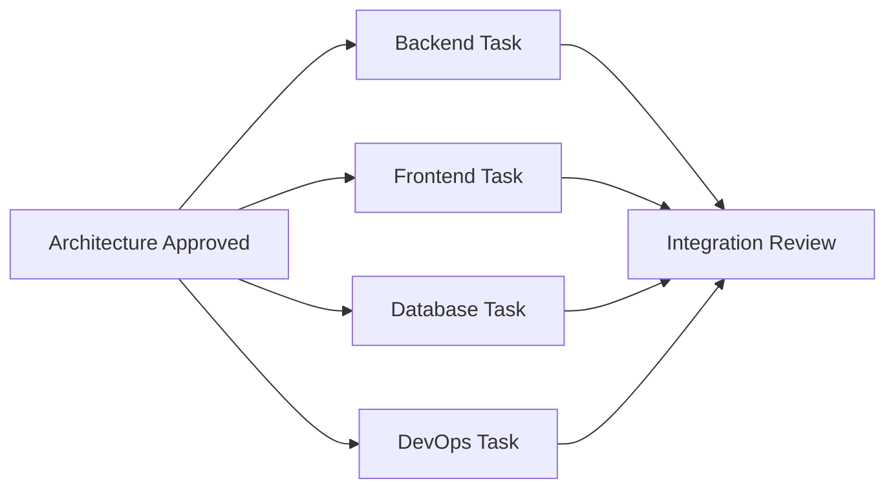
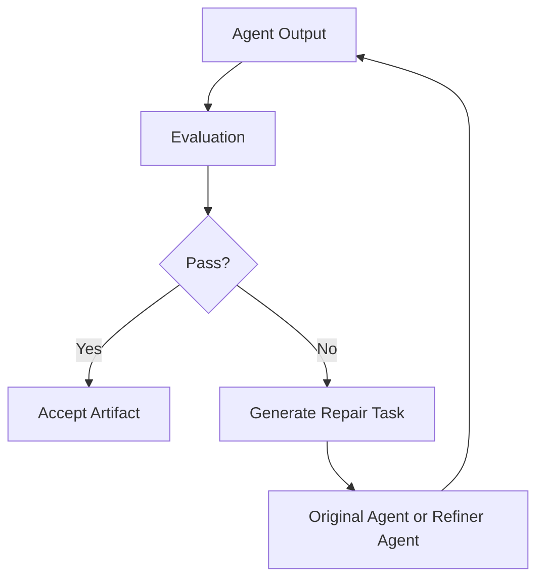

# 07_Workflow_Architecture.md

**Project:** AgentForge  
**Document Version:** 1.0.0  
**Status:** Draft for Implementation  
**Owner:** AgentForge Core Team  
**Last Updated:** June 2026  
**Document Type:** Workflow Architecture Specification  
**Depends On:** `05_System_Architecture.md`, `06_Agent_Architecture.md`  
**Target Runtime:** Google Agent Development Kit (ADK) 2.x  

> This document defines how AgentForge converts a software idea into an executable multi-agent workflow graph with state, routing, retries, human approval, evaluation, and artifact generation.

---

## Related Documents

| Document | Purpose |
|---|---|
| `05_System_Architecture.md` | Master architecture and runtime boundaries. |
| `06_Agent_Architecture.md` | Agent contracts and specialist responsibilities. |
| `08_Memory_Architecture.md` | Workflow state, session memory, project memory, artifacts. |
| `10_Security_Architecture.md` | Security gates and approval rules. |
| `11_Evaluation_Architecture.md` | Evaluation gates and regression rules. |

---

# 1. Purpose

The Workflow Architecture defines how AgentForge coordinates multiple agents to complete complex software engineering tasks.

A workflow is not a loose chain of prompts. It is an explicit execution graph containing:

- nodes,
- edges,
- task dependencies,
- state transitions,
- retry policies,
- parallel branches,
- loop cycles,
- human approval gates,
- security gates,
- evaluation gates,
- completion criteria.

---

# 2. Workflow Architecture Vision

AgentForge workflows should behave like a disciplined engineering process.

The system must:

1. understand the project request,
2. clarify missing requirements,
3. design before coding,
4. implement through specialist agents,
5. evaluate every major artifact,
6. repair failed outputs,
7. document the final result,
8. prepare submission assets.

The workflow engine is the scheduler of the AgentForge AI Software Engineering Operating System.

---

# 3. ADK Alignment

AgentForge aligns with ADK workflow concepts by using:

- sequential workflows for ordered phases,
- parallel workflows for independent tasks,
- loop workflows for refinement cycles,
- graph workflows for conditional routing,
- session state for data passing,
- agent routing for delegation,
- human input for approval and clarification.

ADK examples emphasize specialized agents, parent/sub-agent relationships, session state, sequential execution, loop refinement, and parallel execution. AgentForge formalizes those ideas into an engineering lifecycle.

---

# 4. Workflow Core Concepts

## 4.1 Workflow

A workflow is a full execution plan for a project or subtask.

```python
class WorkflowDefinition(BaseModel):
    workflow_id: str
    name: str
    description: str
    version: str
    entry_node: str
    nodes: list[WorkflowNode]
    edges: list[WorkflowEdge]
    approval_points: list[ApprovalPoint]
    evaluation_gates: list[EvaluationGate]
```

## 4.2 Workflow Run

A workflow run is one execution instance of a workflow definition.

```python
class WorkflowRun(BaseModel):
    run_id: str
    workflow_id: str
    status: WorkflowStatus
    started_at: datetime
    completed_at: datetime | None
    current_nodes: list[str]
    state_ref: str
    events: list[WorkflowEvent]
```

## 4.3 Workflow Node

A node represents one executable step.

Node types:

| Node Type | Purpose |
|---|---|
| `agent_task` | Assign task to a specialist agent. |
| `tool_task` | Execute a tool through a controlled gateway. |
| `approval` | Pause until human approval. |
| `evaluation` | Run quality checks. |
| `security_gate` | Validate safety before proceeding. |
| `condition` | Branch based on state. |
| `join` | Merge parallel branches. |
| `artifact_export` | Persist generated output. |

## 4.4 Workflow Edge

An edge defines allowed movement between nodes.

```python
class WorkflowEdge(BaseModel):
    source: str
    target: str
    condition: str | None
    on_status: list[str]
```

---

# 5. Workflow State Machine



| State | Description |
|---|---|
| `created` | Workflow run object exists but has not started. |
| `validating` | Input, requirements, and permissions are checked. |
| `ready` | Workflow can start. |
| `running` | At least one node is executing. |
| `waiting_for_human` | Execution is paused for clarification or approval. |
| `evaluating` | Output is being scored. |
| `refining` | A failed output is being repaired. |
| `completed` | All required nodes passed. |
| `failed` | Workflow cannot continue automatically. |
| `cancelled` | User or system stopped execution. |

---

# 6. Master Project Generation Workflow



---

# 7. Built-in Workflow Types

## 7.1 Project Intake Workflow

**Goal:** Convert natural language into structured project specification.

Nodes:

1. collect request,
2. extract requirements,
3. validate requirements,
4. ask clarification if needed,
5. create `ProjectSpec`.

Exit criteria:

- `ProjectSpec` exists,
- critical missing requirements resolved or explicitly deferred,
- risk register initialized.

## 7.2 Planning Workflow

**Goal:** Produce milestone and task graph.

Nodes:

1. Planner Agent task decomposition,
2. dependency detection,
3. priority assignment,
4. risk review,
5. evaluation of plan completeness.

Exit criteria:

- `ProjectPlan` created,
- every task has owner capability,
- dependencies are acyclic unless explicitly modeled as loops.

## 7.3 Architecture Workflow

**Goal:** Produce architecture before implementation.

Nodes:

1. Research Agent context gathering,
2. Architecture Agent design draft,
3. Security Agent architecture review,
4. Evaluation Agent architecture scoring,
5. human approval.

Exit criteria:

- `ArchitectureSpec` approved,
- ADRs generated,
- major risks documented.

## 7.4 Implementation Workflow

**Goal:** Generate code and infrastructure artifacts.

Parallel branches:

- backend,
- frontend,
- database,
- DevOps.

Join node:

- integration consistency review.

Exit criteria:

- all code artifacts generated,
- tests generated,
- interfaces are consistent,
- no critical security issue remains.

## 7.5 Evaluation Workflow

**Goal:** Score output quality.

Nodes:

1. static checks,
2. test execution,
3. rubric scoring,
4. architecture consistency check,
5. documentation completeness check.

Exit criteria:

- quality score meets threshold,
- failing sections routed to refinement,
- report stored.

## 7.6 Submission Workflow

**Goal:** Prepare Kaggle/GitHub-ready package.

Nodes:

1. verify README,
2. verify demo guide,
3. verify architecture docs,
4. verify environment instructions,
5. generate final checklist,
6. human approval.

---

# 8. Parallel Execution Model

Independent tasks should execute in parallel when:

- dependencies are satisfied,
- artifacts do not conflict,
- tool permissions are independent,
- shared state writes are controlled.

Example:



Conflict prevention:

- artifact locks,
- branch-specific workspace folders,
- merge review node,
- integration tests.

---

# 9. Loop and Refinement Model

AgentForge must support iterative improvement.



Loop limits:

| Loop Type | Default Max Iterations |
|---|---|
| Requirement clarification | 3 |
| Architecture refinement | 3 |
| Code repair | 5 |
| Documentation repair | 3 |
| Security repair | 3 |

If loop limit is exceeded, the workflow pauses for human intervention.

---

# 10. Human Approval Gates

Human approval must be required for:

- architecture acceptance,
- destructive file changes,
- external deployment,
- ignoring security warnings,
- final submission package,
- dependency changes rated high risk.

Approval record schema:

```python
class ApprovalRecord(BaseModel):
    approval_id: str
    workflow_id: str
    requested_by_agent: str
    action: str
    reason: str
    risk_level: str
    options: list[str]
    selected_option: str | None
    approved_by: str | None
    timestamp: datetime | None
```

---

# 11. Workflow Event Model

Every workflow action emits an event.

```python
class WorkflowEvent(BaseModel):
    event_id: str
    run_id: str
    timestamp: datetime
    event_type: str
    node_id: str | None
    agent_name: str | None
    status: str
    message: str
    metadata: dict[str, Any]
```

Event types:

- `workflow_started`,
- `node_started`,
- `agent_assigned`,
- `tool_requested`,
- `tool_completed`,
- `artifact_created`,
- `evaluation_completed`,
- `approval_requested`,
- `approval_received`,
- `workflow_completed`,
- `workflow_failed`.

---

# 12. Retry Policy

| Failure | Retry Policy |
|---|---|
| Transient LLM failure | Exponential backoff, max 3. |
| Tool timeout | Retry max 2. |
| Schema invalid | Ask agent to repair once. |
| Test failure | Create repair task. |
| Security violation | No automatic retry until reviewed. |
| Missing requirement | Ask user clarification. |

---

# 13. Workflow Persistence

Workflow state must be persisted so execution can resume after interruption.

Persisted objects:

- workflow definition,
- workflow run,
- current node state,
- project context,
- artifacts,
- events,
- approvals,
- evaluation reports.

Storage may start as local SQLite/JSON files and later move to a database-backed store.

---

# 14. Directory Mapping

```text
agentforge/
  application/
    workflows/
      workflow_engine.py
      workflow_definition.py
      workflow_runner.py
      workflow_state.py
      workflow_events.py
      retry_policy.py
      approval_service.py
  domain/
    workflow.py
    task.py
    artifact.py
  infrastructure/
    persistence/
      workflow_store.py
```

---

# 15. Testing Strategy

Workflow tests must validate:

- state transitions,
- graph traversal,
- sequential execution,
- parallel execution,
- loop limits,
- approval pauses,
- retry behavior,
- failure recovery,
- event emission,
- artifact persistence.

Minimum test files:

```text
tests/workflows/test_workflow_engine.py
tests/workflows/test_state_machine.py
tests/workflows/test_parallel_execution.py
tests/workflows/test_refinement_loop.py
tests/workflows/test_human_approval_gate.py
tests/workflows/test_workflow_events.py
```

---

# 16. Requirements Traceability

| Requirement | Workflow Mapping |
|---|---|
| FR-004 Project Planning | Planning Workflow |
| FR-007 Workflow Initialization | Workflow Engine |
| FR-008 Workflow State Management | Workflow State Machine |
| FR-009 Agent Task Routing | Agent Assignment Node |
| FR-011 Tool Execution | Tool Task Node |
| FR-014 Security | Security Gate Node |
| FR-019 Evaluation | Evaluation Gate Node |
| NFR-002 Parallel Execution | Parallel Branch Scheduler |
| NFR-005 Fault Tolerance | Retry Policy + Failure Recovery |
| NFR-016 Structured Logging | Workflow Event Model |

---

# 17. Implementation Checklist

- [ ] Implement workflow domain models.
- [ ] Implement graph validation.
- [ ] Implement workflow runner.
- [ ] Implement state machine.
- [ ] Implement event emission.
- [ ] Implement approval gates.
- [ ] Implement retry policies.
- [ ] Implement parallel execution.
- [ ] Implement refinement loop.
- [ ] Add workflow persistence.
- [ ] Add workflow tests.
