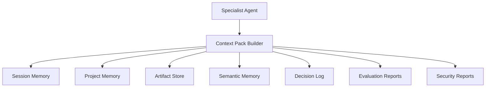
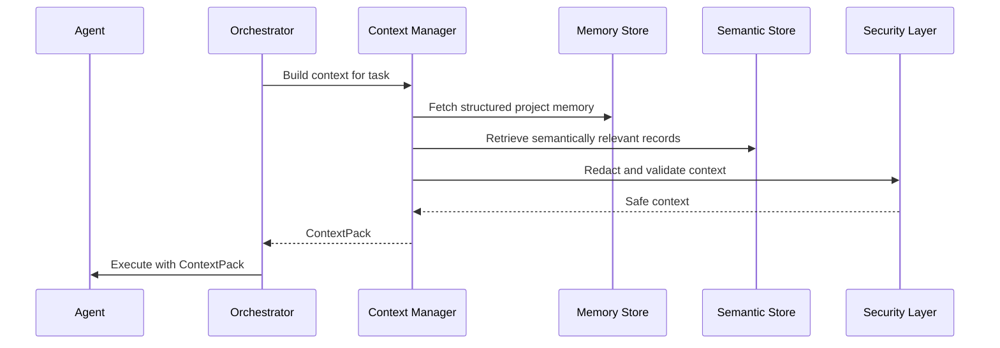

# 08_Memory_Architecture.md

**Project:** AgentForge  
**Document Version:** 1.0.0  
**Status:** Draft for Implementation  
**Owner:** AgentForge Core Team  
**Last Updated:** June 2026  
**Document Type:** Memory Architecture Specification  
**Depends On:** `05_System_Architecture.md`, `06_Agent_Architecture.md`, `07_Workflow_Architecture.md`  
**Target Runtime:** Google Agent Development Kit (ADK) 2.x  

> This document defines how AgentForge stores, retrieves, summarizes, protects, and supplies context to agents across workflows.

---

# 1. Purpose

The Memory Architecture defines how AgentForge manages information over time.

AgentForge agents need memory for:

- user project requirements,
- workflow state,
- architecture decisions,
- generated artifacts,
- task outputs,
- evaluation results,
- security findings,
- long-term reusable knowledge.

Memory must be structured, scoped, auditable, and safe. It must not become an uncontrolled prompt dump.

---

# 2. Memory Architecture Vision

AgentForge memory is divided into four scopes.

| Scope | Purpose | Lifetime |
|---|---|---|
| Request Memory | Current user request and immediate context. | One operation. |
| Session Memory | Current interactive session. | One run/session. |
| Project Memory | Persistent memory for a project. | Full project lifetime. |
| Knowledge Memory | Reusable engineering knowledge. | Long-term, curated. |

The system shall assemble compact context packs for agents instead of passing the entire history to every agent.

---

# 3. ADK Alignment

ADK exposes concepts for sessions, state, memory, artifacts, and runtime execution. AgentForge maps those concepts into a layered memory model:

| ADK Concept | AgentForge Equivalent |
|---|---|
| Session | Session Memory |
| State | Workflow State and Context Variables |
| Artifact | Generated Files and Reports |
| Memory Service | Project Memory and Knowledge Memory |
| Tool Output | Tool Result Record |

AgentForge should use ADK-native memory/session features where they fit, while preserving domain-level memory contracts to avoid framework lock-in.

---

# 4. Memory Types

## 4.1 Request Memory

Stores data for one operation.

Examples:

- current task,
- current agent input,
- current tool request,
- temporary validation result.

Request memory is not persisted unless promoted.

## 4.2 Session Memory

Stores conversation and workflow state for one active run.

Examples:

- clarification answers,
- active workflow run,
- user approvals,
- short-term agent outputs.

## 4.3 Project Memory

Stores durable project state.

Examples:

- `ProjectSpec`,
- `RequirementsSpec`,
- `ArchitectureSpec`,
- `ProjectPlan`,
- task graph,
- decision log,
- generated artifacts,
- evaluation reports,
- security reports.

## 4.4 Knowledge Memory

Stores reusable knowledge.

Examples:

- preferred backend architecture pattern,
- reusable prompt templates,
- common FastAPI project structure,
- evaluation rubrics,
- coding standards.

Knowledge Memory must be curated. Raw unverified LLM output must not be promoted automatically.

---

# 5. Memory Components



## 5.1 Context Manager

The Context Manager decides what information an agent receives.

Responsibilities:

- gather required input artifacts,
- summarize long documents,
- retrieve relevant prior decisions,
- remove irrelevant context,
- redact sensitive data,
- attach acceptance criteria,
- attach evaluation hints.

## 5.2 Artifact Store

Stores generated files and reports.

Artifact types:

- source code,
- markdown docs,
- diagrams,
- configuration files,
- test reports,
- evaluation reports,
- security reports.

## 5.3 Decision Log

Stores architectural and workflow decisions.

Every major decision must include:

- decision,
- reason,
- alternatives considered,
- trade-offs,
- agent/person responsible,
- timestamp,
- affected files.

## 5.4 Semantic Memory

Supports retrieval by meaning.

Examples:

- retrieve related architecture decisions,
- find similar implementation patterns,
- recall previous evaluation failures,
- locate relevant documentation snippets.

Initial implementation may use local vector storage. Future implementation may use managed vector services.

---

# 6. Memory Data Models

## 6.1 Memory Record

```python
class MemoryRecord(BaseModel):
    memory_id: str
    scope: Literal["request", "session", "project", "knowledge"]
    project_id: str | None
    workflow_id: str | None
    title: str
    content: str
    content_type: str
    source: str
    tags: list[str]
    importance: Literal["low", "medium", "high", "critical"]
    created_at: datetime
    expires_at: datetime | None
```

## 6.2 Artifact Reference

```python
class ArtifactRef(BaseModel):
    artifact_id: str
    project_id: str
    path: str
    artifact_type: str
    created_by: str
    version: str
    checksum: str
    metadata: dict[str, Any]
```

## 6.3 Context Pack

```python
class ContextPack(BaseModel):
    context_pack_id: str
    task_id: str
    agent_name: str
    required_inputs: list[ArtifactRef]
    relevant_memories: list[MemoryRecord]
    constraints: dict[str, Any]
    acceptance_criteria: list[str]
    forbidden_actions: list[str]
    security_notes: list[str]
```

---

# 7. Context Pack Strategy

Agents should not receive everything.

Each context pack must include:

1. task objective,
2. required input artifacts,
3. relevant previous decisions,
4. applicable constraints,
5. acceptance criteria,
6. security restrictions,
7. output schema,
8. evaluation rubric.

Context pack size should be controlled through:

- summarization,
- relevance scoring,
- memory scope filtering,
- artifact references instead of full content,
- retrieval limits.

---

# 8. Memory Promotion Rules

Not all information deserves long-term storage.

| Input | Default Action |
|---|---|
| User requirement | Promote to Project Memory. |
| Clarification answer | Promote to Project Memory if affects requirements. |
| Tool result | Store in Session Memory; promote if used in decision. |
| Generated code | Store as Artifact. |
| Architecture decision | Store in Decision Log. |
| Failed output | Store in Evaluation Report, not Knowledge Memory. |
| Verified reusable pattern | Candidate for Knowledge Memory. |

---

# 9. Memory Safety

Memory must enforce:

- secret redaction,
- PII minimization,
- project isolation,
- permission checks,
- prompt-injection filtering,
- audit logging.

Agents must not be allowed to write arbitrary long-term memory without validation.

---

# 10. Artifact Versioning

Each artifact must be versioned.

Version events:

- created,
- modified,
- evaluated,
- rejected,
- approved,
- exported.

Artifact metadata must include:

- creator agent,
- task ID,
- workflow ID,
- checksum,
- evaluation status,
- security status.

---

# 11. Memory Retrieval Flow



---

# 12. Storage Strategy

## 12.1 Version 1 Local Storage

Initial implementation:

```text
.agentforge/
  projects/
    <project_id>/
      project_spec.json
      requirements.json
      architecture.json
      task_graph.json
      workflow_runs/
      artifacts/
      decisions/
      evaluations/
      security/
  memory/
    knowledge.sqlite
    vector_store/
```

## 12.2 Future Storage

Future versions may support:

- Firestore,
- PostgreSQL,
- Chroma,
- Vertex AI Search,
- cloud object storage,
- managed memory services.

---

# 13. Memory Interfaces

```python
class MemoryPort(Protocol):
    async def save(self, record: MemoryRecord) -> None: ...
    async def get(self, memory_id: str) -> MemoryRecord | None: ...
    async def search(self, query: MemoryQuery) -> list[MemoryRecord]: ...
    async def delete(self, memory_id: str) -> None: ...

class ArtifactStorePort(Protocol):
    async def write_artifact(self, artifact: ArtifactWriteRequest) -> ArtifactRef: ...
    async def read_artifact(self, ref: ArtifactRef) -> str | bytes: ...
    async def list_artifacts(self, project_id: str) -> list[ArtifactRef]: ...
```

---

# 14. Testing Strategy

Tests must verify:

- memory scope isolation,
- context pack construction,
- artifact storage and retrieval,
- decision logging,
- secret redaction,
- semantic retrieval relevance,
- project isolation,
- memory promotion rules,
- workflow resume behavior.

Minimum test files:

```text
tests/memory/test_memory_store.py
tests/memory/test_context_pack_builder.py
tests/memory/test_artifact_store.py
tests/memory/test_decision_log.py
tests/memory/test_memory_safety.py
```

---

# 15. Requirements Traceability

| Requirement | Memory Mapping |
|---|---|
| FR-006 Task Prioritization | Stores task metadata and risk. |
| FR-008 Workflow State Management | Session and workflow state. |
| FR-013 Documentation | Artifact store. |
| FR-019 Evaluation | Evaluation report memory. |
| NFR-006 Data Integrity | Versioned memory writes. |
| NFR-015 Secret Management | Redaction and storage policy. |
| NFR-016 Structured Logging | Event and decision records. |

---

# 16. Implementation Checklist

- [ ] Implement memory models.
- [ ] Implement local project memory store.
- [ ] Implement artifact store.
- [ ] Implement decision log.
- [ ] Implement context pack builder.
- [ ] Implement memory redaction.
- [ ] Implement semantic memory adapter placeholder.
- [ ] Add memory tests.
