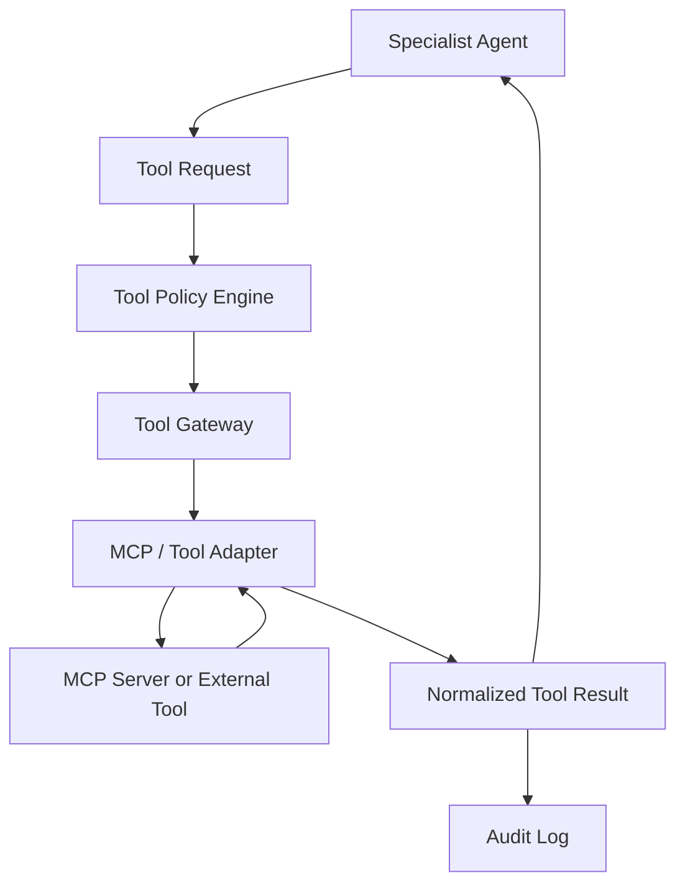
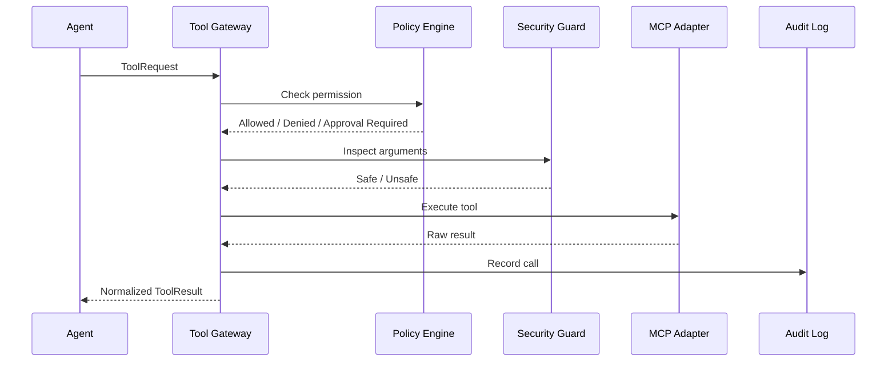

# 09_MCP_Architecture.md

**Project:** AgentForge  
**Document Version:** 1.0.0  
**Status:** Draft for Implementation  
**Owner:** AgentForge Core Team  
**Last Updated:** June 2026  
**Document Type:** MCP and Tool Architecture Specification  
**Depends On:** `05_System_Architecture.md`, `06_Agent_Architecture.md`, `10_Security_Architecture.md`  
**Target Runtime:** Google Agent Development Kit (ADK) 2.x  

> This document defines how AgentForge integrates tools and MCP servers safely through a controlled gateway.

---

# 1. Purpose

AgentForge agents must interact with external capabilities such as file systems, Git, code execution, documentation search, package managers, and deployment tools.

This document defines the architecture for tool access through:

- MCP servers,
- ADK tools,
- internal tool adapters,
- security policy enforcement,
- audit logging,
- tool result normalization.

No agent may call external tools directly. All tool calls must pass through the Tool Gateway.

---

# 2. Tool Architecture Vision

MCP tools are treated as device drivers of the AgentForge AI Software Engineering Operating System.

Agents request capabilities. The Tool Gateway decides whether the call is allowed, safe, properly scoped, and auditable.



---

# 3. ADK Alignment

Google ADK includes tool and integration concepts for connecting agents to external systems. AgentForge uses this idea but adds a stricter enterprise-style access layer:

- every tool has a declared schema,
- every tool call is permission checked,
- every tool call is logged,
- high-risk tool calls require approval,
- tool results are normalized before agents use them.

---

# 4. Tool Categories

| Category | Examples | Risk |
|---|---|---|
| Read-only knowledge | docs search, repository read, package metadata | Low |
| Workspace write | create file, update file, format code | Medium |
| Code execution | Python sandbox, tests, shell command | High |
| Version control | git status, commit, branch, diff | Medium/High |
| Network access | web search, API call, package install | Medium/High |
| Deployment | Docker build, cloud deploy | High |
| Secret access | environment variables, API keys | Critical |

---

# 5. Tool Gateway

## 5.1 Responsibilities

The Tool Gateway must:

- validate tool request schema,
- enforce agent tool permissions,
- enforce project workspace boundaries,
- detect prompt-injection payloads,
- classify risk,
- request approval when needed,
- execute through adapter,
- normalize result,
- write audit log.

## 5.2 Tool Request Schema

```python
class ToolRequest(BaseModel):
    request_id: str
    workflow_id: str
    task_id: str
    agent_name: str
    tool_name: str
    operation: str
    arguments: dict[str, Any]
    risk_level: Literal["low", "medium", "high", "critical"]
    reason: str
```

## 5.3 Tool Result Schema

```python
class ToolResult(BaseModel):
    request_id: str
    tool_name: str
    status: Literal["success", "failed", "denied", "requires_approval"]
    output: str | dict[str, Any] | None
    error: str | None
    artifacts: list[ArtifactRef]
    duration_ms: int
    audit_id: str
```

---

# 6. MCP Gateway

The MCP Gateway is an adapter layer that connects AgentForge to MCP-compatible servers.

Responsibilities:

- discover MCP servers,
- load tool schemas,
- map MCP tool names to AgentForge tool names,
- validate arguments,
- execute requests,
- normalize responses,
- handle retries,
- enforce timeout policies.

```python
class McpGatewayPort(Protocol):
    async def list_servers(self) -> list[McpServerInfo]: ...
    async def list_tools(self, server_id: str) -> list[ToolSpec]: ...
    async def execute(self, request: ToolRequest) -> ToolResult: ...
```

---

# 7. Required Version 1 Tools

## 7.1 Filesystem Tool

Operations:

- read file,
- write file,
- list directory,
- create directory,
- compute checksum.

Restrictions:

- project workspace only,
- no writes outside configured root,
- no hidden destructive operations,
- deletion requires approval.

## 7.2 Git Tool

Operations:

- status,
- diff,
- log,
- branch,
- add,
- commit.

Restrictions:

- commit requires human approval in version 1,
- force push is not allowed,
- credential operations are not allowed.

## 7.3 Python Execution Tool

Operations:

- run tests,
- run formatters,
- run static analysis,
- run controlled scripts.

Restrictions:

- sandbox required,
- timeout required,
- network disabled by default,
- file access scoped to workspace.

## 7.4 Documentation Search Tool

Operations:

- search official docs,
- retrieve documentation snippets,
- record source metadata.

Restrictions:

- prefer official documentation,
- cite source metadata in research artifacts,
- do not execute downloaded code.

## 7.5 Package Metadata Tool

Operations:

- inspect package metadata,
- verify versions,
- identify security notices where available.

Restrictions:

- package installation requires approval unless in dry-run mode.

---

# 8. Tool Permission Matrix

| Agent | Files Read | Files Write | Git | Python Exec | Search | Deploy | Secrets |
|---|---:|---:|---:|---:|---:|---:|---:|
| Requirements Agent | Yes | Limited | No | No | Yes | No | No |
| Planner Agent | Yes | Limited | No | No | Yes | No | No |
| Research Agent | Yes | Limited | No | No | Yes | No | No |
| Architecture Agent | Yes | Yes | No | No | Yes | No | No |
| Backend Agent | Yes | Yes | Limited | Yes | Limited | No | No |
| Frontend Agent | Yes | Yes | Limited | Yes | Limited | No | No |
| Database Agent | Yes | Yes | Limited | Yes | Limited | No | No |
| DevOps Agent | Yes | Yes | Limited | Yes | Limited | Approval | No |
| Security Agent | Yes | Limited | No | Sandbox | Yes | No | Masked Only |
| Evaluation Agent | Yes | Limited | No | Yes | Limited | No | No |
| Documentation Agent | Yes | Yes | No | No | Limited | No | No |
| Submission Agent | Yes | Yes | Limited | Yes | Limited | No | No |

---

# 9. Tool Execution Flow



---

# 10. Tool Security Policy

Tool requests are denied if:

- agent lacks permission,
- path escapes workspace,
- request contains suspicious instructions,
- operation is destructive without approval,
- operation requests secrets directly,
- command attempts privilege escalation,
- command attempts network exfiltration,
- risk exceeds current workflow authorization.

---

# 11. Tool Audit Log

Every tool call must produce an audit record.

```python
class ToolAuditRecord(BaseModel):
    audit_id: str
    timestamp: datetime
    workflow_id: str
    task_id: str
    agent_name: str
    tool_name: str
    operation: str
    arguments_hash: str
    risk_level: str
    decision: str
    duration_ms: int
    result_status: str
```

Sensitive arguments must be hashed or redacted.

---

# 12. Error Handling

| Error | Behavior |
|---|---|
| Tool unavailable | Retry if transient; otherwise block task. |
| Invalid schema | Deny request and return validation error. |
| Permission denied | Return denied result and log event. |
| Timeout | Retry according to policy. |
| Unsafe command | Deny and create security finding. |
| Partial output | Return warning and require evaluation. |

---

# 13. Directory Mapping

```text
agentforge/
  application/
    tools/
      tool_gateway.py
      tool_policy.py
      tool_registry.py
      tool_audit.py
  domain/
    tool.py
    permission.py
  infrastructure/
    mcp/
      mcp_gateway.py
      mcp_server_registry.py
      mcp_tool_adapter.py
    tools/
      filesystem_tool.py
      git_tool.py
      python_exec_tool.py
      docs_search_tool.py
```

---

# 14. Testing Strategy

Required tests:

- tool permission tests,
- path traversal tests,
- denied operation tests,
- MCP adapter mock tests,
- timeout tests,
- retry tests,
- audit log tests,
- sandbox execution tests,
- high-risk approval tests.

Minimum files:

```text
tests/tools/test_tool_gateway.py
tests/tools/test_tool_policy.py
tests/tools/test_mcp_gateway.py
tests/tools/test_tool_audit.py
tests/security/test_tool_path_safety.py
```

---

# 15. Requirements Traceability

| Requirement | MCP/Tool Mapping |
|---|---|
| FR-008 Tool Execution | Tool Gateway |
| FR-009 MCP Integration | MCP Gateway |
| FR-012 Security | Tool Policy Engine |
| FR-014 Documentation | Documentation Search Tool |
| NFR-005 Fault Tolerance | Retry and timeout policy |
| NFR-011 Tool Abstraction | Tool Gateway and MCP Adapter |
| NFR-014 Prompt Injection Protection | Security Guard before execution |
| NFR-016 Structured Logging | Tool Audit Log |

---

# 16. Implementation Checklist

- [ ] Implement ToolRequest and ToolResult models.
- [ ] Implement Tool Gateway.
- [ ] Implement Tool Policy Engine.
- [ ] Implement MCP Gateway interface.
- [ ] Implement local tool adapters.
- [ ] Add permission matrix.
- [ ] Add audit logging.
- [ ] Add tool tests.
