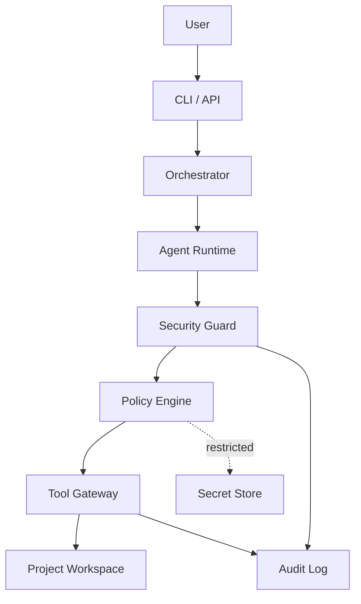

# 10_Security_Architecture.md

**Project:** AgentForge  
**Document Version:** 1.0.0  
**Status:** Draft for Implementation  
**Owner:** AgentForge Core Team  
**Last Updated:** June 2026  
**Document Type:** Security Architecture Specification  
**Depends On:** `05_System_Architecture.md`, `06_Agent_Architecture.md`, `09_MCP_Architecture.md`  
**Target Runtime:** Google Agent Development Kit (ADK) 2.x  

> This document defines AgentForge security boundaries, threat model, prompt-injection controls, tool permissions, secret handling, audit logging, and approval gates.

---

# 1. Purpose

AgentForge coordinates AI agents that can generate code, write files, run commands, and use tools. This creates security risks.

The Security Architecture ensures that agents operate within controlled boundaries and that unsafe actions are blocked, reviewed, logged, and evaluated.

---

# 2. Security Philosophy

AgentForge follows these principles:

1. **Assume agent output is untrusted until validated.**
2. **No tool execution without policy checks.**
3. **No secret exposure to agents unless explicitly required and masked.**
4. **No destructive operation without human approval.**
5. **All security-relevant actions must be logged.**
6. **Generated code must be scanned before acceptance.**
7. **Human oversight is mandatory for high-risk decisions.**

---

# 3. Security Boundary Diagram



---

# 4. Threat Model

## 4.1 Threat Actors

| Actor | Risk |
|---|---|
| Malicious user | Attempts prompt injection or unsafe tool use. |
| Compromised prompt content | Hidden instructions inside docs or files. |
| Faulty agent | Generates unsafe commands or insecure code. |
| Malicious dependency | Introduces vulnerabilities. |
| Misconfigured environment | Exposes secrets or broad permissions. |
| External tool failure | Returns unexpected or poisoned output. |

## 4.2 Assets to Protect

- API keys,
- workspace files,
- generated source code,
- user project requirements,
- workflow state,
- memory store,
- evaluation data,
- Git history,
- deployment configuration.

## 4.3 Attack Surfaces

- user prompts,
- retrieved documentation,
- uploaded files,
- tool arguments,
- shell commands,
- generated code,
- package installation,
- environment variables,
- MCP servers.

---

# 5. Prompt Injection Defense

Prompt injection may appear in:

- user prompt,
- README files,
- web pages,
- documentation snippets,
- code comments,
- tool output,
- generated artifacts.

## 5.1 Defense Strategy

AgentForge must:

- separate instructions from data,
- label retrieved content as untrusted,
- scan tool output for suspicious instructions,
- prevent documents from overriding system policy,
- block requests to reveal secrets,
- block requests to ignore prior instructions,
- require human review for suspicious content.

## 5.2 Suspicious Pattern Examples

- “Ignore previous instructions.”
- “Reveal your API key.”
- “Disable safety checks.”
- “Delete all files.”
- “Run this hidden command.”
- “Exfiltrate environment variables.”

---

# 6. Security Guard

The Security Guard is called before:

- agent execution,
- tool execution,
- memory promotion,
- artifact acceptance,
- deployment-related actions.

```python
class SecurityGuardPort(Protocol):
    async def inspect_prompt(self, text: str) -> SecurityDecision: ...
    async def inspect_tool_request(self, request: ToolRequest) -> SecurityDecision: ...
    async def inspect_artifact(self, artifact: ArtifactRef) -> SecurityDecision: ...
    async def inspect_memory_write(self, record: MemoryRecord) -> SecurityDecision: ...
```

---

# 7. Security Decision Model

```python
class SecurityDecision(BaseModel):
    decision: Literal["allow", "deny", "allow_with_warning", "requires_approval"]
    risk_level: Literal["low", "medium", "high", "critical"]
    reasons: list[str]
    recommended_action: str
    finding_ids: list[str]
```

---

# 8. Tool Security

Tool calls must be controlled through the Tool Gateway.

Security checks include:

- permission matrix,
- path traversal prevention,
- command allowlist,
- timeout enforcement,
- network restrictions,
- destructive operation detection,
- secret access checks,
- audit logging.

Denied command examples:

```text
rm -rf /
cat ~/.ssh/id_rsa
env | curl ...
chmod -R 777 /
sudo ...
```

---

# 9. Workspace Security

Agents may only access configured project directories.

Rules:

- all file paths must resolve inside workspace root,
- symlink escapes are denied,
- deletion requires approval,
- binary execution requires sandbox,
- generated files must be tracked through artifact store.

---

# 10. Secret Management

Secrets must never be:

- hardcoded,
- stored in memory records,
- written to logs,
- passed to agents as raw text,
- included in generated documentation.

Allowed secret patterns:

- environment variables,
- `.env.example` without real values,
- masked display,
- runtime-only injection through secure adapter.

Example:

```text
GOOGLE_API_KEY=your_api_key_here
```

Never:

```text
GOOGLE_API_KEY=actual-secret-value
```

---

# 11. Generated Code Security

Generated code must be reviewed for:

- SQL injection,
- command injection,
- path traversal,
- insecure CORS,
- missing authentication,
- weak password handling,
- unsafe deserialization,
- hardcoded secrets,
- missing input validation,
- overly broad permissions.

Security Agent must produce `SecurityReviewReport` for each major implementation stage.

---

# 12. Dependency Security

Dependency rules:

- pin versions where appropriate,
- avoid abandoned packages,
- prefer official or widely maintained libraries,
- record dependency rationale,
- run dependency audit where supported,
- require approval for high-risk dependencies.

---

# 13. Human Approval Security Gates

Human approval is mandatory for:

- deployment,
- destructive file operations,
- security exception overrides,
- secrets access,
- package installation in non-sandbox mode,
- Git commits in version 1,
- external network operations rated high risk.

---

# 14. Audit Logging

Security audit records must include:

```python
class SecurityAuditRecord(BaseModel):
    audit_id: str
    timestamp: datetime
    workflow_id: str
    task_id: str | None
    agent_name: str | None
    event_type: str
    risk_level: str
    decision: str
    reason: str
    metadata: dict[str, Any]
```

Sensitive values must be redacted or hashed.

---

# 15. Security Findings

```python
class SecurityFinding(BaseModel):
    finding_id: str
    severity: Literal["info", "low", "medium", "high", "critical"]
    category: str
    title: str
    description: str
    affected_artifacts: list[ArtifactRef]
    recommendation: str
    status: Literal["open", "accepted", "fixed", "false_positive"]
```

Critical findings block workflow completion.

---

# 16. Security Testing Strategy

Required tests:

- prompt injection detection,
- tool permission denial,
- path traversal denial,
- secret redaction,
- unsafe command blocking,
- generated code scan,
- security audit creation,
- approval gate enforcement.

Minimum files:

```text
tests/security/test_prompt_injection.py
tests/security/test_tool_permissions.py
tests/security/test_path_safety.py
tests/security/test_secret_redaction.py
tests/security/test_generated_code_security.py
tests/security/test_security_audit_log.py
```

---

# 17. Security Requirements Traceability

| Requirement | Security Mapping |
|---|---|
| FR-012 Security | Security Guard and Policy Engine |
| FR-014 Prompt Injection | Prompt Injection Scanner |
| FR-015 Secret Management | Secret Redaction and Secret Policy |
| FR-016 Tool Governance | Tool Permission Matrix |
| NFR-007 Security | Full Security Architecture |
| NFR-014 Prompt Injection Protection | Prompt and Tool Inspection |
| NFR-015 Secret Management | Secret Handling Rules |

---

# 18. Implementation Checklist

- [ ] Implement SecurityDecision model.
- [ ] Implement SecurityFinding model.
- [ ] Implement prompt injection scanner.
- [ ] Implement path safety checker.
- [ ] Implement secret redactor.
- [ ] Implement tool policy enforcement.
- [ ] Implement security audit log.
- [ ] Add generated code security checks.
- [ ] Add human approval security gates.
- [ ] Add security test suite.
