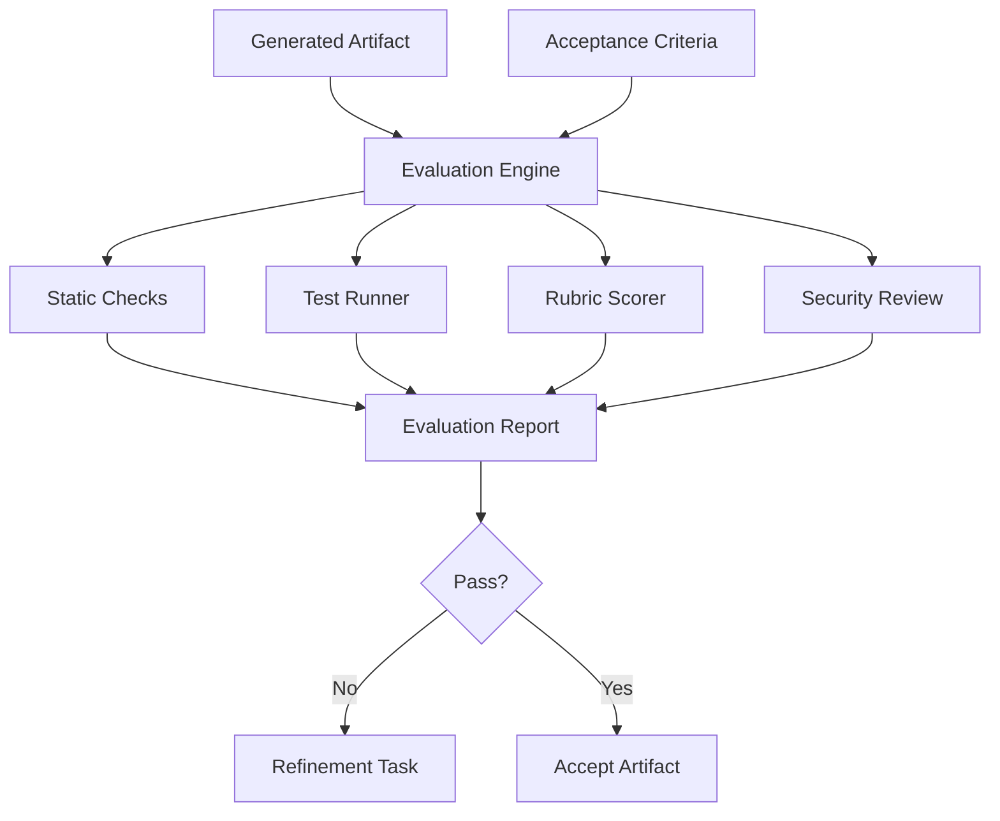
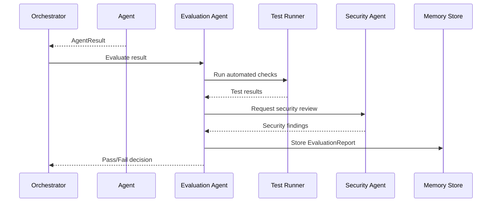

# 11_Evaluation_Architecture.md

**Project:** AgentForge  
**Document Version:** 1.0.0  
**Status:** Draft for Implementation  
**Owner:** AgentForge Core Team  
**Last Updated:** June 2026  
**Document Type:** Evaluation Architecture Specification  
**Depends On:** `05_System_Architecture.md`, `06_Agent_Architecture.md`, `07_Workflow_Architecture.md`, `10_Security_Architecture.md`  
**Target Runtime:** Google Agent Development Kit (ADK) 2.x  

> This document defines how AgentForge evaluates agent outputs, workflows, generated software artifacts, security posture, documentation quality, and capstone readiness.

---

# 1. Purpose

AgentForge must not accept generated output simply because an agent produced it.

The Evaluation Architecture defines:

- what is evaluated,
- when evaluation runs,
- which metrics are used,
- what thresholds are required,
- how failures trigger refinement,
- how evaluation reports are stored,
- how the final capstone submission is scored internally.

---

# 2. Evaluation Philosophy

AgentForge follows evaluation-driven development.

Every major output must pass quality gates before it becomes part of the accepted project.

Evaluation must measure:

- correctness,
- completeness,
- consistency,
- security,
- maintainability,
- testability,
- documentation quality,
- workflow traceability,
- capstone relevance.

---

# 3. ADK Alignment

ADK includes support for building, managing, evaluating, and deploying agents. AgentForge builds on this by defining a project-specific evaluation layer for software engineering outputs.

Evaluation occurs at three levels:

| Level | Description |
|---|---|
| Agent Evaluation | Did one agent complete its task correctly? |
| Workflow Evaluation | Did the full workflow satisfy the project objective? |
| Artifact Evaluation | Are the generated files safe, consistent, tested, and usable? |

---

# 4. Evaluation Architecture Diagram



---

# 5. Evaluation Targets

| Target | Evaluation Questions |
|---|---|
| Requirements | Are requirements complete, clear, and testable? |
| Project Plan | Are tasks actionable and properly ordered? |
| Architecture | Are modules clean, extensible, and consistent with requirements? |
| Backend Code | Does it run, pass tests, validate input, and expose correct APIs? |
| Frontend Code | Does it match API contracts and provide usable UI flows? |
| Database | Is schema normalized, indexed, and consistent? |
| DevOps | Can the project run locally with documented commands? |
| Security | Are secrets protected and high-risk patterns avoided? |
| Documentation | Can a new developer understand and run the project? |
| Submission | Is the project demo-ready and capstone-aligned? |

---

# 6. Evaluation Report Model

```python
class EvaluationReport(BaseModel):
    report_id: str
    workflow_id: str
    task_id: str | None
    artifact_ids: list[str]
    evaluator: str
    status: Literal["pass", "fail", "warning", "needs_review"]
    overall_score: float
    scores: list[EvaluationScore]
    findings: list[EvaluationFinding]
    recommendations: list[str]
    created_at: datetime
```

```python
class EvaluationScore(BaseModel):
    category: str
    score: float
    max_score: float
    weight: float
    reason: str
```

```python
class EvaluationFinding(BaseModel):
    severity: Literal["info", "low", "medium", "high", "critical"]
    category: str
    message: str
    affected_artifact: str | None
    suggested_fix: str
```

---

# 7. Quality Gates

## 7.1 Architecture Gate

Required checks:

- requirements mapped to components,
- no obvious circular dependencies,
- plugin architecture preserved,
- security boundaries defined,
- deployment model defined,
- diagrams present.

Minimum passing score: 80%.

## 7.2 Code Gate

Required checks:

- project imports successfully,
- tests pass,
- formatting passes,
- type checks pass where configured,
- no placeholder implementations,
- no hardcoded secrets,
- error handling exists.

Minimum passing score: 85%.

## 7.3 Security Gate

Required checks:

- no critical security findings,
- no raw secrets,
- tool permissions respected,
- generated code scanned,
- dependency risks documented.

Critical finding policy: block workflow.

## 7.4 Documentation Gate

Required checks:

- README complete,
- setup instructions present,
- environment variables documented,
- architecture explanation present,
- demo steps present,
- limitations documented.

Minimum passing score: 80%.

## 7.5 Submission Gate

Required checks:

- capstone objective clearly explained,
- multi-agent workflow demonstrated,
- ADK usage explained,
- repository reproducible,
- demo guide complete,
- final checklist complete.

Minimum passing score: 90%.

---

# 8. Rubric-Based Evaluation

Every evaluation rubric should use weighted categories.

Example architecture rubric:

| Category | Weight |
|---|---:|
| Requirement alignment | 20% |
| Modularity | 20% |
| Extensibility | 15% |
| Security boundaries | 15% |
| Workflow clarity | 15% |
| Documentation clarity | 15% |

Example code rubric:

| Category | Weight |
|---|---:|
| Correctness | 25% |
| Maintainability | 20% |
| Test coverage | 20% |
| Security | 15% |
| Type safety | 10% |
| Documentation | 10% |

---

# 9. Automated Checks

Version 1 should support:

- pytest,
- ruff,
- black check,
- mypy where practical,
- import validation,
- file existence checks,
- markdown link checks where practical,
- secret scanning,
- generated artifact completeness checks.

---

# 10. Evaluation Workflow



---

# 11. Refinement Policy

If evaluation fails:

| Failure Type | Action |
|---|---|
| Minor formatting issue | Auto-repair by original agent. |
| Missing documentation | Route to Documentation Agent. |
| Test failure | Route to responsible implementation agent. |
| Architecture inconsistency | Route to Architecture Agent. |
| Security issue | Route to Security Agent and block until fixed. |
| Repeated failure | Pause for human review. |

---

# 12. Evaluation Dataset Strategy

AgentForge should maintain small test fixtures for predictable evaluation.

Examples:

```text
evaluation/fixtures/
  project_requests/
    simple_fastapi_app.md
    react_dashboard.md
    fullstack_crud_app.md
  expected_artifacts/
  rubrics/
    architecture_rubric.yaml
    backend_rubric.yaml
    documentation_rubric.yaml
```

The purpose is to verify that workflow behavior remains stable as agents and prompts evolve.

---

# 13. Regression Testing

Regression tests must confirm:

- a known project request still generates expected artifacts,
- workflows still reach completion,
- no security gate is bypassed,
- output schemas remain valid,
- evaluation scores do not drop below threshold.

---

# 14. Evaluation Storage

Evaluation reports must be stored in project memory.

Suggested directory:

```text
.agentforge/projects/<project_id>/evaluations/
  architecture_report.json
  backend_report.json
  frontend_report.json
  security_report.json
  submission_report.json
```

---

# 15. Human Review Integration

Evaluation may request human review when:

- confidence is low,
- scores are near threshold,
- security findings are high impact,
- requirements are ambiguous,
- repeated refinement fails,
- final submission is ready.

Human review decisions must be stored as approval records.

---

# 16. Metrics

Required metrics:

| Metric | Purpose |
|---|---|
| workflow_success_rate | Measures completed workflows. |
| average_quality_score | Tracks output quality. |
| refinement_count | Detects unstable agents. |
| security_findings_count | Tracks risk. |
| test_pass_rate | Tracks code reliability. |
| documentation_completeness | Tracks submission readiness. |
| agent_failure_rate | Finds weak agents. |

---

# 17. Directory Mapping

```text
agentforge/
  application/
    evaluation/
      evaluation_engine.py
      rubric_scorer.py
      quality_gate.py
      regression_runner.py
      report_writer.py
  domain/
    evaluation.py
  infrastructure/
    evaluation/
      pytest_runner.py
      ruff_runner.py
      secret_scanner.py

evaluation/
  fixtures/
  rubrics/
  reports/
```

---

# 18. Testing Strategy

Minimum test files:

```text
tests/evaluation/test_evaluation_engine.py
tests/evaluation/test_rubric_scorer.py
tests/evaluation/test_quality_gates.py
tests/evaluation/test_refinement_policy.py
tests/evaluation/test_regression_runner.py
```

---

# 19. Requirements Traceability

| Requirement | Evaluation Mapping |
|---|---|
| FR-011 Evaluation | Evaluation Engine |
| FR-012 Security | Security Gate Integration |
| FR-013 Documentation | Documentation Gate |
| FR-019 Automated Testing | Test Runner Integration |
| NFR-008 Code Quality | Static Checks |
| NFR-019 Automated Testing | CI Evaluation Suite |
| NFR-024 Documentation Completeness | Documentation Gate |

---

# 20. Implementation Checklist

- [ ] Implement EvaluationReport model.
- [ ] Implement rubric scorer.
- [ ] Implement quality gates.
- [ ] Implement test runner adapter.
- [ ] Implement secret scanner adapter.
- [ ] Implement documentation completeness checker.
- [ ] Implement regression fixture runner.
- [ ] Store reports in project memory.
- [ ] Add evaluation tests.
